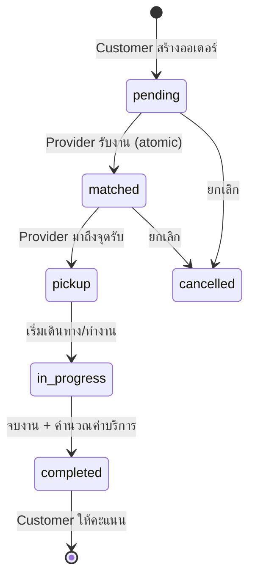
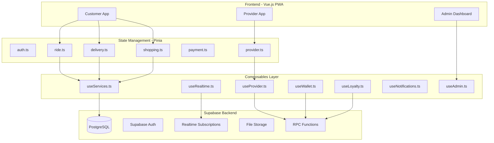

# Design Document - Full Functionality Integration

## Overview

เอกสารนี้อธิบายการออกแบบสำหรับการทำให้ทุกฟีเจอร์ในแอปพลิเคชัน Thai Ride-Hailing ทำงานได้จริงกับฐานข้อมูล Supabase โดยเน้นการเชื่อมต่อที่ถูกต้อง ลื่นไหล และทำงานได้จริงครบทุก flow

## Architecture

### Complete Service Flow



### System Architecture



### Key Components

| Layer | Customer | Provider | Admin |
|-------|----------|----------|-------|
| Views | ServicesView, DeliveryView, ShoppingView, OrderTrackingView | ProviderDashboardView, ProviderDocumentsView | AdminDashboardView, AdminUsersView, AdminProvidersView |
| Stores | ride.ts, delivery.ts, shopping.ts, payment.ts | provider.ts | - |
| Composables | useServices, useDelivery, useShopping, useWallet, useLoyalty | useProvider, useProviderEarnings, useProviderTracking | useAdmin, useAnalytics |
| Realtime | subscribeToRide, subscribeToDriverLocation | subscribeToRequests, subscribeToJob | subscribeToProviders |

## Components and Interfaces

### 1. Customer Core Services

| Component | File | Tables | RPC Functions |
|-----------|------|--------|---------------|
| Ride Store | stores/ride.ts | ride_requests, ride_ratings | find_nearby_providers, calculate_ride_fare |
| Delivery Store | stores/delivery.ts | delivery_requests, delivery_ratings | calculate_delivery_fee, accept_delivery_request, update_delivery_status |
| Shopping Store | stores/shopping.ts | shopping_requests, shopping_ratings | calculate_shopping_fee, accept_shopping_request, update_shopping_status |
| Wallet | composables/useWallet.ts | user_wallets, wallet_transactions | add_wallet_transaction, get_wallet_balance |
| Loyalty | composables/useLoyalty.ts | user_loyalty, points_transactions, loyalty_rewards | add_loyalty_points, get_loyalty_summary, redeem_reward |

### 2. Provider Dashboard

| Component | File | Tables | RPC Functions |
|-----------|------|--------|---------------|
| Provider Core | composables/useProvider.ts | service_providers, ride_requests, delivery_requests, shopping_requests | accept_ride_request, update_ride_status, set_provider_availability |
| Earnings | composables/useProviderEarnings.ts | provider_withdrawals, provider_daily_stats, provider_online_sessions | get_provider_earnings_summary, request_withdrawal |
| Tracking | composables/useProviderTracking.ts | service_providers | update_provider_location |
| Performance | composables/useProviderPerformance.ts | service_providers, ride_ratings | get_provider_performance_score |

### 3. Admin Dashboard

| Component | File | Tables | Key Functions |
|-----------|------|--------|---------------|
| Admin Core | composables/useAdmin.ts | All tables | CRUD operations, statistics |
| Analytics | composables/useAnalytics.ts | ride_requests, delivery_requests, shopping_requests | Dashboard aggregations |
| Feedback | composables/useCustomerFeedback.ts | customer_feedback | NPS tracking |
| Service Area | composables/useServiceArea.ts | service_areas | Area management |

### 4. Shared Services

| Component | File | Tables | Key Functions |
|-----------|------|--------|---------------|
| Realtime | composables/useRealtime.ts | All realtime tables | subscribeToTable, broadcastStatus |
| Notifications | composables/useNotifications.ts | user_notifications, push_notification_queue | sendNotification, markAsRead |
| Push | composables/usePushNotifications.ts | push_subscriptions | subscribeToPush, sendPush |
| Safety | composables/useSafety.ts | emergency_contacts, safety_incidents, trip_shares | triggerSOS, shareTrip |
| Promos | composables/usePromos.ts | promo_codes, user_promo_usage | validatePromoCode, usePromoCode |
| Referral | composables/useReferral.ts | referral_codes, referrals | generateReferralCode, applyReferralCode |

## Data Models

### Key Tables (28 migrations)

**Core Tables:**
- `users`: User profiles with member_uid (TRD-XXXXXXXX format)
- `service_providers`: Provider profiles, location, availability
- `ride_requests`: Ride data with status flow
- `delivery_requests`: Delivery with tracking_id (DEL-YYYYMMDD-XXXXXX)
- `shopping_requests`: Shopping with item list

**Financial Tables:**
- `user_wallets`: Customer wallet balance
- `wallet_transactions`: Transaction history
- `provider_withdrawals`: Provider withdrawal requests
- `provider_daily_stats`: Daily earnings statistics

**Loyalty & Promos:**
- `user_loyalty`: User loyalty status and tier
- `points_transactions`: Points history
- `loyalty_rewards`: Available rewards
- `promo_codes`: Promo code definitions
- `user_promo_usage`: Promo usage tracking

**Support & Safety:**
- `support_tickets`: Support ticket tracking
- `safety_incidents`: SOS incidents
- `trip_shares`: Trip sharing records
- `emergency_contacts`: User emergency contacts

**Ratings:**
- `ride_ratings`: Ride ratings
- `delivery_ratings`: Delivery ratings
- `shopping_ratings`: Shopping ratings
- `customer_feedback`: NPS feedback

### Key RPC Functions

**Atomic Operations (FOR UPDATE NOWAIT):**
- `accept_ride_request`: Atomic ride acceptance with double-booking prevention
- `accept_delivery_request`: Atomic delivery acceptance
- `accept_shopping_request`: Atomic shopping acceptance

**Status Management:**
- `update_ride_status`: Status transition with validation
- `update_delivery_status`: Delivery status with validation
- `update_shopping_status`: Shopping status with items_cost support

**Provider Functions:**
- `find_nearby_providers`: Location-based provider search
- `set_provider_availability`: Online/offline toggle with session tracking
- `get_available_rides_for_provider`: Fetch pending rides in radius
- `get_available_deliveries_for_provider`: Fetch pending deliveries
- `get_available_shopping_for_provider`: Fetch pending shopping

**Financial Functions:**
- `add_wallet_transaction`: Atomic wallet operations
- `get_wallet_balance`: Get current balance
- `request_withdrawal`: Provider withdrawal request
- `get_provider_earnings_summary`: Earnings statistics

**Loyalty Functions:**
- `add_loyalty_points`: Award/deduct points
- `get_loyalty_summary`: Get points, tier, rewards
- `redeem_reward`: Redeem loyalty reward
- `check_tier_upgrade`: Auto tier upgrade check

**Promo Functions:**
- `validate_promo_code`: Validate expiry, usage, eligibility
- `use_promo_code`: Apply promo and record usage
- `generate_referral_code`: Create unique referral code
- `apply_referral_code`: Reward both parties


## Correctness Properties

*A property is a characteristic or behavior that should hold true across all valid executions of a system-essentially, a formal statement about what the system should do. Properties serve as the bridge between human-readable specifications and machine-verifiable correctness guarantees.*

### Property 1: Ride Request Persistence
*For any* valid ride request with pickup and destination locations, creating the request SHALL result in a new record in the database with status 'pending' and a unique tracking_id
**Validates: Requirements 1.1**

### Property 2: Atomic Ride Acceptance
*For any* pending ride request, when multiple providers attempt to accept simultaneously, exactly one provider SHALL be assigned and all others SHALL receive rejection
**Validates: Requirements 1.2, 4.3**

### Property 3: Valid Status Transitions
*For any* ride request, status transitions SHALL follow the valid path: pending → matched → pickup → in_progress → completed (or cancelled from any state before completed)
**Validates: Requirements 1.3, 1.4, 1.5, 4.4**

### Property 4: Earnings Consistency
*For any* completed ride, the provider's balance SHALL increase by the ride fare amount and daily stats SHALL be updated
**Validates: Requirements 1.5, 4.5**

### Property 5: Rating Persistence
*For any* submitted rating, the rating SHALL be saved and the provider's average rating SHALL be recalculated correctly
**Validates: Requirements 1.6**

### Property 6: Delivery Request Persistence
*For any* valid delivery request, creating the request SHALL result in a new record with tracking_id and calculated fee
**Validates: Requirements 2.1**

### Property 7: Shopping Request Persistence
*For any* valid shopping request with item list, creating the request SHALL result in a new record with items stored and service fee calculated
**Validates: Requirements 3.1**

### Property 8: Provider Availability Toggle
*For any* provider, toggling online status SHALL update is_available flag and start/end online session tracking
**Validates: Requirements 4.1**

### Property 9: Wallet Balance Consistency
*For any* wallet transaction (topup, payment, refund), the wallet balance SHALL be updated atomically and transaction record SHALL be created
**Validates: Requirements 6.2, 6.3, 6.4**

### Property 10: Realtime Status Sync
*For any* status change in ride_requests, all subscribed clients SHALL receive the update via Supabase Realtime
**Validates: Requirements 7.3, 7.5**

### Property 11: Notification Persistence
*For any* triggered notification, a record SHALL be created in user_notifications with correct user_id
**Validates: Requirements 8.1**

### Property 12: Loyalty Points Consistency
*For any* completed service, loyalty points SHALL be awarded based on points_rules
**Validates: Requirements 9.1**

### Property 13: Promo Code Validation
*For any* promo code application, the system SHALL validate expiry, usage limit, and eligibility before applying
**Validates: Requirements 10.1, 10.5**

### Property 14: Referral Reward Distribution
*For any* successful referral, both referrer and referee SHALL receive rewards
**Validates: Requirements 10.4**

### Property 15: Support Ticket Persistence
*For any* support ticket creation, the ticket SHALL be saved with tracking_id
**Validates: Requirements 11.1**

## Status Flow Diagrams

### Ride Status Flow
```
pending → matched → pickup → in_progress → completed
                                        ↘ cancelled (from any state before completed)
```

### Delivery Status Flow
```
pending → matched → pickup → in_transit → delivered
                                       ↘ cancelled
```

### Shopping Status Flow
```
pending → matched → shopping → delivering → completed
                            ↘ cancelled
```

## Error Handling

### Network Errors
- Retry with exponential backoff (max 3 attempts)
- Show offline indicator when disconnected (useOfflineStorage.ts)
- Queue actions for retry when connection restored (useBackgroundSync.ts)
- Optimistic updates with rollback (useOptimisticUpdate.ts)

### Database Errors
- Display user-friendly Thai error messages
- Log errors to Sentry for monitoring (lib/sentry.ts)
- Fallback to cached data when available (useOfflineCache.ts)
- Request deduplication (useRequestDedup.ts)

### Validation Errors
- Validate inputs before API calls
- Show inline validation messages in Thai
- Prevent submission of invalid data
- Thai National ID validation with check digit

### Atomic Operation Errors
- FOR UPDATE NOWAIT prevents double-booking
- Transaction rollback on failure
- Clear error messages for race conditions

## Testing Strategy

### Unit Tests (Vitest)
- Test fare calculation functions (useFareEstimator.ts)
- Test status formatting functions
- Test input validation (Thai ID, phone, etc.)
- Test ETA calculations (useETA.ts)

### Integration Tests
- Test Supabase connection
- Test CRUD operations on each table
- Test RPC function calls
- Test Realtime subscriptions
- Test atomic operations (accept_ride_request, etc.)

### Property-Based Tests (fast-check)
- **Property 1**: Ride Request Persistence - tracking_id generation
- **Property 2**: Atomic Ride Acceptance - double-booking prevention
- **Property 3**: Valid Status Transitions - state machine validation
- **Property 4**: Earnings Consistency - balance updates
- **Property 5**: Rating Persistence - average recalculation
- **Property 6**: Delivery Request Persistence
- **Property 7**: Shopping Request Persistence
- **Property 8**: Provider Availability Toggle
- **Property 9**: Wallet Balance Consistency
- **Property 10**: Realtime Status Sync
- **Property 11**: Notification Persistence
- **Property 12**: Loyalty Points Consistency
- **Property 13**: Promo Code Validation
- **Property 14**: Referral Reward Distribution
- **Property 15**: Support Ticket Persistence

### End-to-End Tests
- Test complete ride flow: create → match → complete → rate
- Test complete delivery flow: create → match → deliver
- Test complete shopping flow: create → match → shop → deliver
- Test provider dashboard: online → accept → complete
- Test wallet: topup → payment → refund
- Test loyalty: earn points → redeem reward

## Implementation Status

### ✅ Completed (Phase 1-3)
- Core Ride Flow (Customer → Provider → Complete)
- Delivery Service with atomic acceptance
- Shopping Service with items_cost support
- Provider Dashboard with all job types
- Status transitions with validation
- Audit log triggers
- Tracking ID auto-generation

### ⏳ In Progress (Phase 4-9)
- Wallet and Payment operations
- Realtime subscriptions optimization
- Notification system
- Loyalty and Promos
- Support and Safety
- Admin Dashboard
- Advanced Features (Scheduled, Insurance, etc.)

## Security Considerations

### Row Level Security (RLS)
- Users can only access their own data
- Providers can only access assigned jobs
- Admins have full access via service role

### Atomic Operations
- FOR UPDATE NOWAIT prevents race conditions
- Transaction isolation for financial operations
- Audit logging for all status changes

### Data Protection
- Member UID instead of email for tracking
- Phone number verification required
- Thai National ID validation
