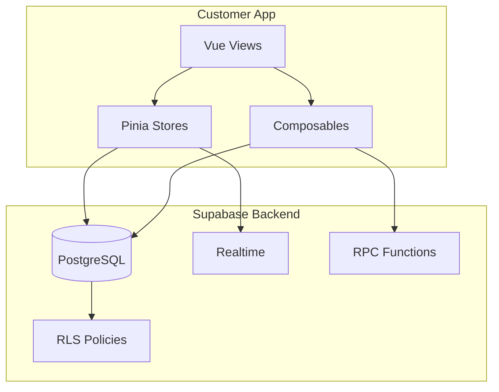

# Design Document - Full Functionality Integration

## Overview

เอกสารนี้อธิบายการออกแบบสำหรับการทำให้ทุกฟีเจอร์ในแอปพลิเคชัน Thai Ride-Hailing ทำงานได้จริงกับฐานข้อมูล Supabase โดยเริ่มจาก Customer Core Services (เรียกรถ, ส่งของ, ซื้อของ)

## Architecture

### Current State Analysis

จากการตรวจสอบ codebase พบว่า:

1. **Database (Supabase)**: มีตารางครบถ้วนแล้ว (60+ tables)
2. **Stores (Pinia)**: มี ride.ts, delivery.ts, shopping.ts ที่เชื่อมต่อ Supabase
3. **Composables**: มี useServices.ts, useDelivery.ts ที่มี business logic
4. **Views**: มี ServicesView.vue, DeliveryView.vue ที่ใช้ stores/composables

### Integration Flow



## Components and Interfaces

### Customer Core Services

#### 1. Ride Service (F02)
- **Store**: `stores/ride.ts`
- **Composable**: `composables/useServices.ts`
- **View**: `views/ServicesView.vue`
- **Tables**: `ride_requests`, `service_providers`, `ride_ratings`

#### 2. Delivery Service (F03)
- **Store**: `stores/delivery.ts`
- **Composable**: `composables/useDelivery.ts`
- **View**: `views/DeliveryView.vue`
- **Tables**: `delivery_requests`, `service_providers`

#### 3. Shopping Service (F04)
- **Store**: `stores/shopping.ts`
- **Composable**: `composables/useShopping.ts`
- **View**: `views/ShoppingView.vue`
- **Tables**: `shopping_requests`, `service_providers`

## Data Models

### Existing Database Tables (Verified)

```typescript
// ride_requests - มีอยู่แล้ว
interface RideRequest {
  id: string
  user_id: string
  provider_id: string | null
  pickup_lat: number
  pickup_lng: number
  pickup_address: string
  destination_lat: number
  destination_lng: number
  destination_address: string
  ride_type: 'standard' | 'premium' | 'shared' | 'moto'
  passenger_count: number
  estimated_fare: number
  final_fare: number | null
  status: 'pending' | 'matched' | 'pickup' | 'in_progress' | 'completed' | 'cancelled'
  tracking_id: string
  created_at: string
}

// delivery_requests - มีอยู่แล้ว
interface DeliveryRequest {
  id: string
  tracking_id: string
  user_id: string
  provider_id: string | null
  sender_name: string
  sender_phone: string
  sender_address: string
  sender_lat: number
  sender_lng: number
  recipient_name: string
  recipient_phone: string
  recipient_address: string
  recipient_lat: number
  recipient_lng: number
  package_type: 'document' | 'small' | 'medium' | 'large' | 'fragile'
  package_weight: number
  estimated_fee: number
  status: 'pending' | 'matched' | 'pickup' | 'in_transit' | 'delivered' | 'cancelled'
  created_at: string
}

// shopping_requests - มีอยู่แล้ว
interface ShoppingRequest {
  id: string
  tracking_id: string
  user_id: string
  provider_id: string | null
  store_name: string
  store_address: string
  store_lat: number
  store_lng: number
  delivery_address: string
  delivery_lat: number
  delivery_lng: number
  items: any[] // JSON array
  budget_limit: number
  service_fee: number
  status: 'pending' | 'matched' | 'shopping' | 'delivering' | 'completed' | 'cancelled'
  created_at: string
}
```

## Correctness Properties

*A property is a characteristic or behavior that should hold true across all valid executions of a system-essentially, a formal statement about what the system should do. Properties serve as the bridge between human-readable specifications and machine-verifiable correctness guarantees.*

### Property 1: Ride Request Persistence
*For any* valid ride request with pickup and destination locations, creating the request SHALL result in a new record in the database with status 'pending' and a unique tracking_id
**Validates: Requirements 1.1**

### Property 2: Delivery Request Persistence
*For any* valid delivery request with sender and recipient details, creating the request SHALL result in a new record with calculated fee and tracking_id
**Validates: Requirements 1.2**

### Property 3: Shopping Request Persistence
*For any* valid shopping request with store and item list, creating the request SHALL result in a new record with service fee and tracking_id
**Validates: Requirements 1.3**

### Property 4: Real-time Status Updates
*For any* active order, status changes in the database SHALL be reflected in the UI within 2 seconds via Supabase Realtime
**Validates: Requirements 1.4**

### Property 5: Order Cancellation
*For any* order in cancellable status (pending, matched), cancellation SHALL update status to 'cancelled' and prevent further status changes
**Validates: Requirements 1.5**

## Error Handling

### Network Errors
- Retry with exponential backoff (max 3 attempts)
- Show offline indicator when disconnected
- Queue actions for retry when connection restored

### Database Errors
- Display user-friendly Thai error messages
- Log errors to console for debugging
- Fallback to cached data when available

### Validation Errors
- Validate inputs before API calls
- Show inline validation messages
- Prevent submission of invalid data

## Testing Strategy

### Unit Tests
- Test fare calculation functions
- Test status formatting functions
- Test input validation

### Integration Tests
- Test Supabase connection
- Test CRUD operations on each table
- Test Realtime subscriptions

### Property-Based Tests
- Test that all created orders have valid tracking IDs
- Test that status transitions follow valid paths
- Test that fee calculations are consistent

## Implementation Checklist

### Phase 1: Verify Existing Functionality
1. ✅ Database tables exist
2. ✅ Stores connect to Supabase
3. ✅ Composables have business logic
4. ⬜ Views properly use stores/composables
5. ⬜ Realtime subscriptions work

### Phase 2: Fix Issues
1. ⬜ Fix any broken database queries
2. ⬜ Fix RLS policies if needed
3. ⬜ Fix type mismatches
4. ⬜ Add missing error handling

### Phase 3: Test End-to-End
1. ⬜ Test ride booking flow
2. ⬜ Test delivery request flow
3. ⬜ Test shopping request flow
4. ⬜ Test order tracking
5. ⬜ Test cancellation
