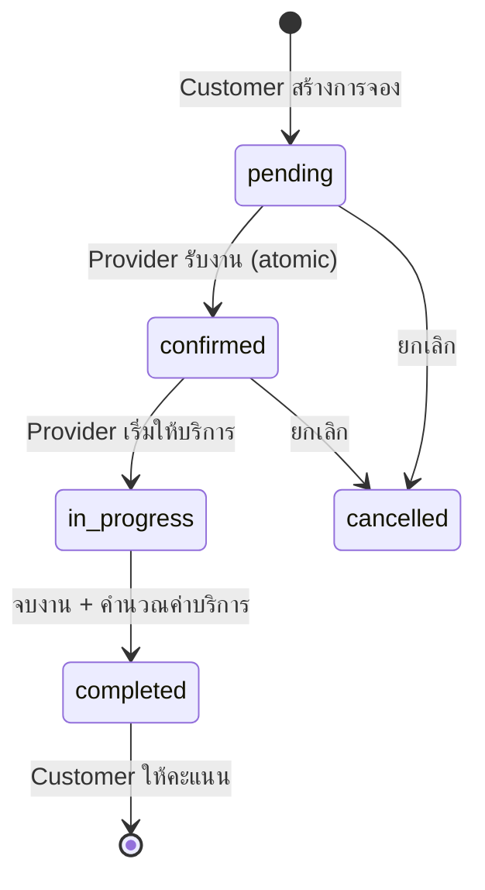
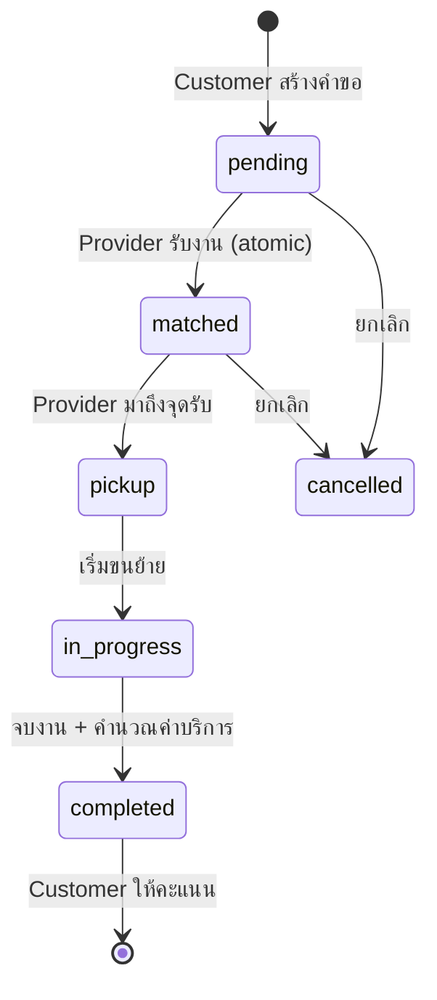
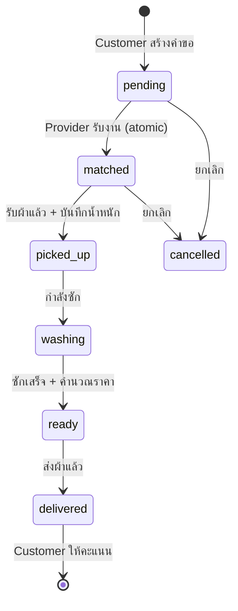
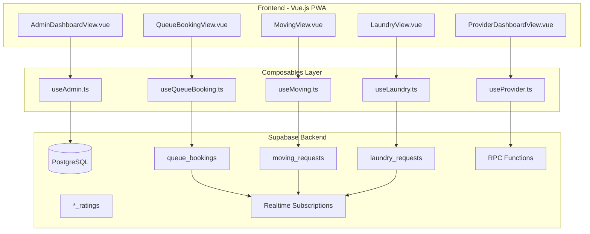

# Design Document - New Services Backend

## Overview

เอกสารนี้อธิบายการออกแบบ database tables และ backend สำหรับบริการใหม่ 3 อย่าง:
1. **Queue Booking** - จองคิวร้านค้า/โรงพยาบาล/หน่วยงานราชการ
2. **Moving Service** - ยกของ/ขนย้าย
3. **Laundry Service** - รับ-ส่งซักผ้า

## Architecture

### Service Flow Diagrams

#### Queue Booking Flow


#### Moving Service Flow


#### Laundry Service Flow


### System Architecture



## Components and Interfaces

### 1. Queue Booking Service

| Component | File | Tables | RPC Functions |
|-----------|------|--------|---------------|
| Queue Composable | composables/useQueueBooking.ts | queue_bookings, queue_ratings | create_queue_booking, accept_queue_booking, update_queue_status |
| Queue View | views/QueueBookingView.vue | - | - |
| Queue History | views/QueueHistoryView.vue | queue_bookings | - |

### 2. Moving Service

| Component | File | Tables | RPC Functions |
|-----------|------|--------|---------------|
| Moving Composable | composables/useMoving.ts | moving_requests, moving_ratings | create_moving_request, accept_moving_request, update_moving_status, calculate_moving_price |
| Moving View | views/MovingView.vue | - | - |
| Moving Tracking | views/MovingTrackingView.vue | moving_requests | - |

### 3. Laundry Service

| Component | File | Tables | RPC Functions |
|-----------|------|--------|---------------|
| Laundry Composable | composables/useLaundry.ts | laundry_requests, laundry_ratings | create_laundry_request, accept_laundry_request, update_laundry_status, calculate_laundry_price |
| Laundry View | views/LaundryView.vue | - | - |
| Laundry Tracking | views/LaundryTrackingView.vue | laundry_requests | - |

### 4. Provider Integration

| Component | File | Tables | RPC Functions |
|-----------|------|--------|---------------|
| Provider Core | composables/useProvider.ts | service_providers, all request tables | get_available_queue_jobs, get_available_moving_jobs, get_available_laundry_jobs |

### 5. Admin Integration

| Component | File | Tables | Key Functions |
|-----------|------|--------|---------------|
| Admin Core | composables/useAdmin.ts | All tables | CRUD operations, statistics |
| Admin Queue View | views/AdminQueueView.vue | queue_bookings | - |
| Admin Moving View | views/AdminMovingView.vue | moving_requests | - |
| Admin Laundry View | views/AdminLaundryView.vue | laundry_requests | - |

## Data Models

### Queue Bookings Table

```sql
CREATE TABLE queue_bookings (
    id UUID PRIMARY KEY DEFAULT gen_random_uuid(),
    tracking_id TEXT UNIQUE NOT NULL,
    user_id UUID REFERENCES users(id) NOT NULL,
    provider_id UUID REFERENCES service_providers(id),
    
    -- Category
    category TEXT NOT NULL CHECK (category IN ('hospital', 'bank', 'government', 'restaurant', 'salon', 'other')),
    
    -- Details
    place_name TEXT,
    place_address TEXT,
    details TEXT,
    
    -- Schedule
    scheduled_date DATE NOT NULL,
    scheduled_time TIME NOT NULL,
    
    -- Status
    status TEXT NOT NULL DEFAULT 'pending' CHECK (status IN ('pending', 'confirmed', 'in_progress', 'completed', 'cancelled')),
    
    -- Pricing
    service_fee DECIMAL(10,2) DEFAULT 50.00,
    final_fee DECIMAL(10,2),
    
    -- Cancellation
    cancelled_at TIMESTAMPTZ,
    cancel_reason TEXT,
    
    -- Timestamps
    created_at TIMESTAMPTZ DEFAULT NOW(),
    updated_at TIMESTAMPTZ DEFAULT NOW(),
    completed_at TIMESTAMPTZ
);
```

### Moving Requests Table

```sql
CREATE TABLE moving_requests (
    id UUID PRIMARY KEY DEFAULT gen_random_uuid(),
    tracking_id TEXT UNIQUE NOT NULL,
    user_id UUID REFERENCES users(id) NOT NULL,
    provider_id UUID REFERENCES service_providers(id),
    
    -- Service Type
    service_type TEXT NOT NULL CHECK (service_type IN ('small', 'medium', 'large')),
    
    -- Locations
    pickup_address TEXT NOT NULL,
    pickup_lat DECIMAL(10,8),
    pickup_lng DECIMAL(11,8),
    destination_address TEXT NOT NULL,
    destination_lat DECIMAL(10,8),
    destination_lng DECIMAL(11,8),
    
    -- Details
    item_description TEXT,
    helper_count INTEGER DEFAULT 1 CHECK (helper_count >= 1 AND helper_count <= 5),
    
    -- Status
    status TEXT NOT NULL DEFAULT 'pending' CHECK (status IN ('pending', 'matched', 'pickup', 'in_progress', 'completed', 'cancelled')),
    
    -- Pricing
    estimated_price DECIMAL(10,2) NOT NULL,
    final_price DECIMAL(10,2),
    
    -- Cancellation
    cancelled_at TIMESTAMPTZ,
    cancel_reason TEXT,
    
    -- Timestamps
    created_at TIMESTAMPTZ DEFAULT NOW(),
    updated_at TIMESTAMPTZ DEFAULT NOW(),
    pickup_at TIMESTAMPTZ,
    completed_at TIMESTAMPTZ
);
```

### Laundry Requests Table

```sql
CREATE TABLE laundry_requests (
    id UUID PRIMARY KEY DEFAULT gen_random_uuid(),
    tracking_id TEXT UNIQUE NOT NULL,
    user_id UUID REFERENCES users(id) NOT NULL,
    provider_id UUID REFERENCES service_providers(id),
    
    -- Services (JSON array)
    services JSONB NOT NULL DEFAULT '[]',
    -- Example: ["wash-fold", "express"]
    
    -- Pickup Details
    pickup_address TEXT NOT NULL,
    pickup_lat DECIMAL(10,8),
    pickup_lng DECIMAL(11,8),
    scheduled_pickup TIMESTAMPTZ NOT NULL,
    
    -- Weight & Pricing
    estimated_weight DECIMAL(5,2),
    actual_weight DECIMAL(5,2),
    price_per_kg DECIMAL(10,2) DEFAULT 40.00,
    estimated_price DECIMAL(10,2),
    final_price DECIMAL(10,2),
    
    -- Status
    status TEXT NOT NULL DEFAULT 'pending' CHECK (status IN ('pending', 'matched', 'picked_up', 'washing', 'ready', 'delivered', 'cancelled')),
    
    -- Notes
    notes TEXT,
    
    -- Cancellation
    cancelled_at TIMESTAMPTZ,
    cancel_reason TEXT,
    
    -- Timestamps
    created_at TIMESTAMPTZ DEFAULT NOW(),
    updated_at TIMESTAMPTZ DEFAULT NOW(),
    picked_up_at TIMESTAMPTZ,
    ready_at TIMESTAMPTZ,
    delivered_at TIMESTAMPTZ
);
```

### Rating Tables

```sql
-- Queue Ratings
CREATE TABLE queue_ratings (
    id UUID PRIMARY KEY DEFAULT gen_random_uuid(),
    booking_id UUID REFERENCES queue_bookings(id) NOT NULL,
    user_id UUID REFERENCES users(id) NOT NULL,
    provider_id UUID REFERENCES service_providers(id) NOT NULL,
    rating INTEGER NOT NULL CHECK (rating >= 1 AND rating <= 5),
    comment TEXT,
    created_at TIMESTAMPTZ DEFAULT NOW()
);

-- Moving Ratings
CREATE TABLE moving_ratings (
    id UUID PRIMARY KEY DEFAULT gen_random_uuid(),
    request_id UUID REFERENCES moving_requests(id) NOT NULL,
    user_id UUID REFERENCES users(id) NOT NULL,
    provider_id UUID REFERENCES service_providers(id) NOT NULL,
    rating INTEGER NOT NULL CHECK (rating >= 1 AND rating <= 5),
    comment TEXT,
    created_at TIMESTAMPTZ DEFAULT NOW()
);

-- Laundry Ratings
CREATE TABLE laundry_ratings (
    id UUID PRIMARY KEY DEFAULT gen_random_uuid(),
    request_id UUID REFERENCES laundry_requests(id) NOT NULL,
    user_id UUID REFERENCES users(id) NOT NULL,
    provider_id UUID REFERENCES service_providers(id) NOT NULL,
    rating INTEGER NOT NULL CHECK (rating >= 1 AND rating <= 5),
    comment TEXT,
    created_at TIMESTAMPTZ DEFAULT NOW()
);
```

### Key RPC Functions

```sql
-- Generate Tracking ID
CREATE OR REPLACE FUNCTION generate_service_tracking_id(prefix TEXT)
RETURNS TEXT AS $$
DECLARE
    date_part TEXT;
    seq_num INTEGER;
    tracking_id TEXT;
BEGIN
    date_part := TO_CHAR(NOW(), 'YYYYMMDD');
    
    -- Get next sequence number for today
    SELECT COALESCE(MAX(
        CAST(SUBSTRING(tracking_id FROM LENGTH(prefix) + 10 FOR 6) AS INTEGER)
    ), 0) + 1
    INTO seq_num
    FROM (
        SELECT tracking_id FROM queue_bookings WHERE tracking_id LIKE prefix || '-' || date_part || '%'
        UNION ALL
        SELECT tracking_id FROM moving_requests WHERE tracking_id LIKE prefix || '-' || date_part || '%'
        UNION ALL
        SELECT tracking_id FROM laundry_requests WHERE tracking_id LIKE prefix || '-' || date_part || '%'
    ) t;
    
    tracking_id := prefix || '-' || date_part || '-' || LPAD(seq_num::TEXT, 6, '0');
    RETURN tracking_id;
END;
$$ LANGUAGE plpgsql;

-- Accept Queue Booking (Atomic)
CREATE OR REPLACE FUNCTION accept_queue_booking(
    p_booking_id UUID,
    p_provider_id UUID
) RETURNS JSONB AS $$
DECLARE
    v_booking queue_bookings%ROWTYPE;
BEGIN
    -- Lock the row
    SELECT * INTO v_booking
    FROM queue_bookings
    WHERE id = p_booking_id
    FOR UPDATE NOWAIT;
    
    IF NOT FOUND THEN
        RETURN jsonb_build_object('success', false, 'error', 'Booking not found');
    END IF;
    
    IF v_booking.status != 'pending' THEN
        RETURN jsonb_build_object('success', false, 'error', 'Booking already taken');
    END IF;
    
    -- Update booking
    UPDATE queue_bookings
    SET status = 'confirmed',
        provider_id = p_provider_id,
        updated_at = NOW()
    WHERE id = p_booking_id;
    
    RETURN jsonb_build_object('success', true, 'booking_id', p_booking_id);
EXCEPTION
    WHEN lock_not_available THEN
        RETURN jsonb_build_object('success', false, 'error', 'Booking is being processed');
END;
$$ LANGUAGE plpgsql;

-- Accept Moving Request (Atomic)
CREATE OR REPLACE FUNCTION accept_moving_request(
    p_request_id UUID,
    p_provider_id UUID
) RETURNS JSONB AS $$
DECLARE
    v_request moving_requests%ROWTYPE;
BEGIN
    SELECT * INTO v_request
    FROM moving_requests
    WHERE id = p_request_id
    FOR UPDATE NOWAIT;
    
    IF NOT FOUND THEN
        RETURN jsonb_build_object('success', false, 'error', 'Request not found');
    END IF;
    
    IF v_request.status != 'pending' THEN
        RETURN jsonb_build_object('success', false, 'error', 'Request already taken');
    END IF;
    
    UPDATE moving_requests
    SET status = 'matched',
        provider_id = p_provider_id,
        updated_at = NOW()
    WHERE id = p_request_id;
    
    RETURN jsonb_build_object('success', true, 'request_id', p_request_id);
EXCEPTION
    WHEN lock_not_available THEN
        RETURN jsonb_build_object('success', false, 'error', 'Request is being processed');
END;
$$ LANGUAGE plpgsql;

-- Accept Laundry Request (Atomic)
CREATE OR REPLACE FUNCTION accept_laundry_request(
    p_request_id UUID,
    p_provider_id UUID
) RETURNS JSONB AS $$
DECLARE
    v_request laundry_requests%ROWTYPE;
BEGIN
    SELECT * INTO v_request
    FROM laundry_requests
    WHERE id = p_request_id
    FOR UPDATE NOWAIT;
    
    IF NOT FOUND THEN
        RETURN jsonb_build_object('success', false, 'error', 'Request not found');
    END IF;
    
    IF v_request.status != 'pending' THEN
        RETURN jsonb_build_object('success', false, 'error', 'Request already taken');
    END IF;
    
    UPDATE laundry_requests
    SET status = 'matched',
        provider_id = p_provider_id,
        updated_at = NOW()
    WHERE id = p_request_id;
    
    RETURN jsonb_build_object('success', true, 'request_id', p_request_id);
EXCEPTION
    WHEN lock_not_available THEN
        RETURN jsonb_build_object('success', false, 'error', 'Request is being processed');
END;
$$ LANGUAGE plpgsql;

-- Calculate Moving Price
CREATE OR REPLACE FUNCTION calculate_moving_price(
    p_service_type TEXT,
    p_helper_count INTEGER
) RETURNS DECIMAL AS $$
DECLARE
    base_price DECIMAL;
    helper_fee DECIMAL;
BEGIN
    -- Base price by service type
    CASE p_service_type
        WHEN 'small' THEN base_price := 150;
        WHEN 'medium' THEN base_price := 350;
        WHEN 'large' THEN base_price := 1500;
        ELSE base_price := 150;
    END CASE;
    
    -- Additional helper fee (100 per extra helper)
    helper_fee := (p_helper_count - 1) * 100;
    
    RETURN base_price + helper_fee;
END;
$$ LANGUAGE plpgsql;

-- Calculate Laundry Price
CREATE OR REPLACE FUNCTION calculate_laundry_price(
    p_services JSONB,
    p_weight DECIMAL
) RETURNS DECIMAL AS $$
DECLARE
    total_price DECIMAL := 0;
    service TEXT;
    price_per_kg DECIMAL;
    express_fee DECIMAL := 0;
BEGIN
    -- Calculate base price per kg based on services
    IF p_services ? 'dry-clean' THEN
        -- Dry clean is per piece, estimate 5 pieces per kg
        total_price := p_weight * 5 * 150;
    ELSIF p_services ? 'wash-iron' THEN
        price_per_kg := 60;
        total_price := p_weight * price_per_kg;
    ELSE
        -- Default wash-fold
        price_per_kg := 40;
        total_price := p_weight * price_per_kg;
    END IF;
    
    -- Express fee
    IF p_services ? 'express' THEN
        express_fee := 100;
    END IF;
    
    RETURN total_price + express_fee;
END;
$$ LANGUAGE plpgsql;
```

## Correctness Properties

*A property is a characteristic or behavior that should hold true across all valid executions of a system-essentially, a formal statement about what the system should do. Properties serve as the bridge between human-readable specifications and machine-verifiable correctness guarantees.*

### Property 1: Service Request Persistence
*For any* valid service request (queue, moving, or laundry), creating the request SHALL result in a new record in the database with status 'pending' and a unique tracking_id in the correct format (QUE/MOV/LAU-YYYYMMDD-XXXXXX)
**Validates: Requirements 1.1, 2.1, 3.1**

### Property 2: Future Date Validation
*For any* queue booking with a scheduled date/time, the system SHALL reject bookings where the scheduled time is in the past
**Validates: Requirements 1.3**

### Property 3: Atomic Job Acceptance
*For any* pending service request, when multiple providers attempt to accept simultaneously, exactly one provider SHALL be assigned and all others SHALL receive rejection
**Validates: Requirements 1.4, 2.5, 3.4, 4.2**

### Property 4: Valid Status Transitions
*For any* service request, status transitions SHALL follow the valid path defined for each service type (queue: pending → confirmed → in_progress → completed; moving: pending → matched → pickup → in_progress → completed; laundry: pending → matched → picked_up → washing → ready → delivered)
**Validates: Requirements 1.5, 2.6, 2.7, 2.8, 3.5, 3.6, 3.7, 4.3**

### Property 5: Earnings Consistency
*For any* completed service, the provider's balance SHALL increase by the service fee amount
**Validates: Requirements 1.5, 2.8, 3.7, 4.4**

### Property 6: Moving Price Calculation
*For any* moving request, the estimated price SHALL be calculated based on service type (small: ฿150, medium: ฿350, large: ฿1500) plus helper fee (฿100 per additional helper)
**Validates: Requirements 2.2, 2.4**

### Property 7: Laundry Price by Weight
*For any* laundry request with actual weight recorded, the final price SHALL be calculated based on weight and selected services (wash-fold: ฿40/kg, wash-iron: ฿60/kg, dry-clean: ฿150/piece, express: +฿100)
**Validates: Requirements 3.6**

### Property 8: Rating Persistence
*For any* submitted rating for any service type, the rating SHALL be saved to the appropriate ratings table with correct foreign key references
**Validates: Requirements 2.9, 3.8**

### Property 9: Booking History Ordering
*For any* user viewing their booking history, the results SHALL be ordered by created_at descending (newest first)
**Validates: Requirements 1.7**

### Property 10: Cancellation Recording
*For any* cancelled service request, the status SHALL be 'cancelled', cancelled_at SHALL be set, and cancel_reason SHALL be recorded if provided
**Validates: Requirements 1.6**

## Error Handling

### Network Errors
- Retry with exponential backoff (max 3 attempts)
- Show offline indicator when disconnected
- Queue actions for retry when connection restored
- Optimistic updates with rollback

### Database Errors
- Display user-friendly Thai error messages
- Log errors to Sentry for monitoring
- Fallback to cached data when available

### Validation Errors
- Validate inputs before API calls
- Show inline validation messages in Thai
- Prevent submission of invalid data
- Future date validation for queue bookings

### Atomic Operation Errors
- FOR UPDATE NOWAIT prevents double-booking
- Transaction rollback on failure
- Clear error messages for race conditions

## Testing Strategy

### Unit Tests (Vitest)
- Test price calculation functions (calculate_moving_price, calculate_laundry_price)
- Test tracking_id generation format
- Test status transition validation
- Test input validation

### Property-Based Tests (fast-check)
- **Property 1**: Service Request Persistence - tracking_id format validation
- **Property 2**: Future Date Validation - date comparison
- **Property 3**: Atomic Job Acceptance - concurrent acceptance simulation
- **Property 4**: Valid Status Transitions - state machine validation
- **Property 5**: Earnings Consistency - balance updates
- **Property 6**: Moving Price Calculation - price formula
- **Property 7**: Laundry Price by Weight - weight-based pricing
- **Property 8**: Rating Persistence - rating storage
- **Property 9**: Booking History Ordering - query ordering
- **Property 10**: Cancellation Recording - cancellation data

### Integration Tests
- Test Supabase connection
- Test CRUD operations on each table
- Test RPC function calls
- Test Realtime subscriptions
- Test atomic operations

### End-to-End Tests
- Test complete queue booking flow: create → confirm → complete → rate
- Test complete moving flow: create → match → pickup → complete → rate
- Test complete laundry flow: create → match → pickup → wash → deliver → rate
- Test provider dashboard with all service types
- Test admin management for all services

## Security Considerations

### Row Level Security (RLS)
- Users can only access their own requests
- Providers can only access assigned jobs
- Admins have full access via service role

### Atomic Operations
- FOR UPDATE NOWAIT prevents race conditions
- Transaction isolation for financial operations
- Audit logging for all status changes

### Data Protection
- Tracking ID instead of internal ID for public reference
- Address data protected by RLS
- Phone numbers masked in public views

