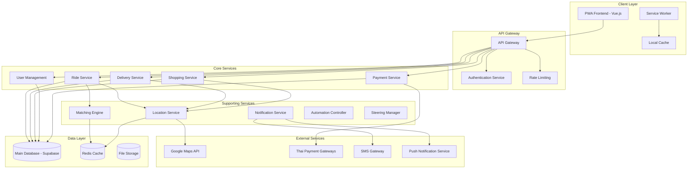

# Design Document

## Overview

ระบบเรียกรถแบบ Native Web App สำหรับประเทศไทย ที่ใช้เทคโนโลยี Vue.js + Vite และ PWA เพื่อให้บริการครบวงจร ระบบจะมีสถาปัตยกรรมแบบ Microservices ที่รองรับการขยายตัวและการทำงานอัตโนมัติ พร้อมด้วยระบบควบคุมที่เข้มงวดและ UI/UX ที่คล้าย Uber

## Architecture

### High-Level Architecture



### Technology Stack

- **Frontend**: Vue.js 3 + Vite + TypeScript
- **PWA**: Workbox for service worker management
- **State Management**: Pinia
- **UI Framework**: Tailwind CSS + Custom components (Uber-like design)
- **Maps**: Google Maps JavaScript API
- **Backend**: Supabase (PostgreSQL + Real-time + Auth + Storage)
- **Caching**: Redis for session and location data
- **Payment**: Thai payment gateways (PromptPay, SCB Easy, K PLUS)
- **Notifications**: Firebase Cloud Messaging
- **Deployment**: Vercel/Netlify for frontend, Supabase for backend

## Components and Interfaces

### Frontend Components

#### Core PWA Components
- **AppShell**: Main application shell with navigation
- **ServiceWorkerManager**: Handles offline functionality and caching
- **InstallPrompt**: PWA installation prompt component
- **OfflineIndicator**: Shows connection status

#### Service Components
- **RideBooking**: Ride request and booking interface
- **DeliveryRequest**: Package delivery request form
- **ShoppingRequest**: Personal shopping service interface
- **ServiceTracking**: Real-time tracking for all services
- **PaymentManager**: Payment method selection and processing

#### UI Components (Uber-style)
- **MapView**: Interactive map with markers and routes
- **LocationPicker**: Address selection with Thai address support
- **ServiceCard**: Service type selection cards
- **DriverCard**: Driver information and rating display
- **PriceEstimator**: Fare calculation and display
- **ChatInterface**: In-app messaging between users and providers

### Backend Services

#### User Management Service
```typescript
interface UserService {
  registerUser(userData: UserRegistration): Promise<User>
  verifyThaiID(nationalId: string): Promise<boolean>
  updateProfile(userId: string, profile: UserProfile): Promise<User>
  getUserLocation(userId: string): Promise<Location>
}
```

#### Ride Service
```typescript
interface RideService {
  createRideRequest(request: RideRequest): Promise<RideBooking>
  findAvailableDrivers(location: Location, radius: number): Promise<Driver[]>
  calculateFare(pickup: Location, destination: Location): Promise<FareEstimate>
  trackRide(rideId: string): Promise<RideStatus>
}
```

#### Delivery Service
```typescript
interface DeliveryService {
  createDeliveryRequest(request: DeliveryRequest): Promise<DeliveryBooking>
  calculateDeliveryFee(package: PackageDetails): Promise<DeliveryFee>
  trackPackage(deliveryId: string): Promise<DeliveryStatus>
  confirmDelivery(deliveryId: string, confirmation: DeliveryConfirmation): Promise<boolean>
}
```

#### Shopping Service
```typescript
interface ShoppingService {
  createShoppingRequest(request: ShoppingRequest): Promise<ShoppingBooking>
  findPersonalShoppers(location: Location): Promise<PersonalShopper[]>
  updateShoppingProgress(shoppingId: string, progress: ShoppingProgress): Promise<boolean>
  approveAlternativeItems(shoppingId: string, alternatives: AlternativeItem[]): Promise<boolean>
}
```

## Data Models

### Core Entities

#### User Model
```typescript
interface User {
  id: string
  nationalId: string // Thai National ID
  phoneNumber: string // Thai phone format
  email: string
  firstName: string
  lastName: string
  profileImage?: string
  verificationStatus: 'pending' | 'verified' | 'rejected'
  preferredLanguage: 'th' | 'en'
  createdAt: Date
  updatedAt: Date
}
```

#### Service Provider Model
```typescript
interface ServiceProvider {
  id: string
  userId: string
  providerType: 'driver' | 'delivery' | 'shopper'
  vehicleInfo?: VehicleInfo
  licenseNumber?: string
  backgroundCheckStatus: 'pending' | 'approved' | 'rejected'
  rating: number
  totalTrips: number
  isOnline: boolean
  currentLocation?: Location
  serviceRadius: number // in kilometers
}
```

#### Ride Request Model
```typescript
interface RideRequest {
  id: string
  userId: string
  pickupLocation: Location
  destinationLocation: Location
  rideType: 'standard' | 'premium' | 'shared'
  scheduledTime?: Date
  passengerCount: number
  specialRequests?: string
  estimatedFare: number
  status: RideStatus
  createdAt: Date
}
```

#### Location Model
```typescript
interface Location {
  latitude: number
  longitude: number
  address: string
  district: string // อำเภอ
  province: string // จังหวัด
  postalCode: string
  landmark?: string
  placeId?: string // Google Places ID
}
```

### Database Schema (Supabase/PostgreSQL)

```sql
-- Users table with Thai-specific fields
CREATE TABLE users (
  id UUID PRIMARY KEY DEFAULT gen_random_uuid(),
  national_id VARCHAR(13) UNIQUE NOT NULL,
  phone_number VARCHAR(15) UNIQUE NOT NULL,
  email VARCHAR(255) UNIQUE NOT NULL,
  first_name VARCHAR(100) NOT NULL,
  last_name VARCHAR(100) NOT NULL,
  profile_image TEXT,
  verification_status VARCHAR(20) DEFAULT 'pending',
  preferred_language VARCHAR(2) DEFAULT 'th',
  created_at TIMESTAMP WITH TIME ZONE DEFAULT NOW(),
  updated_at TIMESTAMP WITH TIME ZONE DEFAULT NOW()
);

-- Service providers table
CREATE TABLE service_providers (
  id UUID PRIMARY KEY DEFAULT gen_random_uuid(),
  user_id UUID REFERENCES users(id) ON DELETE CASCADE,
  provider_type VARCHAR(20) NOT NULL,
  license_number VARCHAR(50),
  background_check_status VARCHAR(20) DEFAULT 'pending',
  rating DECIMAL(3,2) DEFAULT 5.0,
  total_trips INTEGER DEFAULT 0,
  is_online BOOLEAN DEFAULT false,
  current_location POINT,
  service_radius INTEGER DEFAULT 5,
  created_at TIMESTAMP WITH TIME ZONE DEFAULT NOW()
);

-- Ride requests table
CREATE TABLE ride_requests (
  id UUID PRIMARY KEY DEFAULT gen_random_uuid(),
  user_id UUID REFERENCES users(id) ON DELETE CASCADE,
  provider_id UUID REFERENCES service_providers(id),
  pickup_location POINT NOT NULL,
  pickup_address TEXT NOT NULL,
  destination_location POINT NOT NULL,
  destination_address TEXT NOT NULL,
  ride_type VARCHAR(20) DEFAULT 'standard',
  scheduled_time TIMESTAMP WITH TIME ZONE,
  passenger_count INTEGER DEFAULT 1,
  special_requests TEXT,
  estimated_fare DECIMAL(10,2),
  actual_fare DECIMAL(10,2),
  status VARCHAR(20) DEFAULT 'pending',
  created_at TIMESTAMP WITH TIME ZONE DEFAULT NOW(),
  updated_at TIMESTAMP WITH TIME ZONE DEFAULT NOW()
);
```

## Correctness Properties

*A property is a characteristic or behavior that should hold true across all valid executions of a system-essentially, a formal statement about what the system should do. Properties serve as the bridge between human-readable specifications and machine-verifiable correctness guarantees.*

### Property Reflection

After reviewing all testable properties from the prework analysis, I've identified several areas where properties can be consolidated to eliminate redundancy:

**Consolidation Areas:**
1. **Real-time tracking properties** (2.3, 3.3, 5.4) can be combined into a single comprehensive tracking property
2. **Payment processing properties** (2.4, 5.5, 10.2) can be unified into one payment processing property
3. **Notification properties** (2.5, 5.2, 6.2) can be consolidated into a comprehensive notification system property
4. **Validation properties** (3.1, 4.1, 7.1) can be combined into a single input validation property
5. **Thai localization properties** (9.1, 9.3, 9.4) can be merged into one localization property

**Properties to Remove or Consolidate:**
- Properties 2.3, 3.3, 5.4 → Combined into Property 1 (Real-time tracking)
- Properties 2.4, 5.5, 10.2 → Combined into Property 2 (Payment processing)
- Properties 2.5, 5.2, 6.2 → Combined into Property 3 (Notification system)
- Properties 3.1, 4.1, 7.1 → Combined into Property 4 (Input validation)
- Properties 9.1, 9.3, 9.4 → Combined into Property 5 (Thai localization)

This consolidation reduces redundancy while maintaining comprehensive coverage of all functional requirements.

### Correctness Properties

Property 1: Real-time tracking consistency
*For any* active service (ride, delivery, shopping), the system should provide continuous location updates and accurate estimated arrival times throughout the service duration
**Validates: Requirements 2.3, 3.3, 5.4**

Property 2: Payment processing reliability
*For any* completed service transaction, the system should automatically process payment through the configured method and update all relevant financial records
**Validates: Requirements 2.4, 5.5, 10.2**

Property 3: Notification system completeness
*For any* system event requiring user notification, the system should deliver notifications to all relevant parties within the appropriate service radius or relationship
**Validates: Requirements 2.5, 5.2, 6.2**

Property 4: Input validation consistency
*For any* user input form (registration, service requests, provider applications), the system should validate all required fields according to Thai standards and business rules
**Validates: Requirements 3.1, 4.1, 7.1**

Property 5: Thai localization completeness
*For any* displayed content, the system should use proper Thai language, currency formatting (Thai Baht), and timezone (Asia/Bangkok) consistently
**Validates: Requirements 9.1, 9.3, 9.4**

Property 6: PWA offline functionality
*For any* cached content, the system should remain accessible and functional when network connectivity is lost
**Validates: Requirements 1.3**

Property 7: Driver matching accuracy
*For any* ride request, the system should only match drivers within the specified 2-kilometer radius
**Validates: Requirements 2.2**

Property 8: Fee calculation accuracy
*For any* service request (ride, delivery, shopping), the system should calculate fees based on distance, service type, and additional parameters with consistent pricing rules
**Validates: Requirements 2.1, 3.2, 4.4**

Property 9: Service completion requirements
*For any* service completion, the system should enforce all required confirmations (photos, signatures, receipts) before marking the service as complete
**Validates: Requirements 3.4, 4.3**

Property 10: Provider status synchronization
*For any* service provider status change, the system should immediately update availability and location information across all system components
**Validates: Requirements 5.1**

Property 11: Security protocol activation
*For any* detected suspicious activity or failed transaction, the system should trigger appropriate security measures and retry mechanisms
**Validates: Requirements 6.2, 6.3**

Property 12: Thai compliance validation
*For any* regulatory requirement, the system should enforce Thai transportation laws, consumer protection rules, and tax compliance
**Validates: Requirements 7.5, 10.4, 10.5**

Property 13: UI consistency maintenance
*For any* user interface element, the system should maintain Uber-like design patterns, Thai language support, and accessibility standards
**Validates: Requirements 8.1, 8.3, 8.5**

Property 14: Performance requirement adherence
*For any* application load, the system should display content within 3 seconds on 3G networks and provide responsive user interactions
**Validates: Requirements 1.4, 8.2**

## Error Handling

### Error Categories and Strategies

#### Network and Connectivity Errors
- **Offline Mode**: Service worker caches critical functionality
- **Slow Network**: Progressive loading with skeleton screens
- **Connection Loss**: Queue actions for retry when connection restored
- **API Timeouts**: Exponential backoff retry strategy

#### Payment Processing Errors
- **Payment Failure**: Automatic retry with alternative payment methods
- **Insufficient Funds**: Clear Thai error messages with top-up suggestions
- **Gateway Timeout**: Fallback to alternative payment processors
- **Fraud Detection**: Temporary account suspension with manual review

#### Location and Mapping Errors
- **GPS Unavailable**: Manual address entry with Thai address validation
- **Inaccurate Location**: Address confirmation with landmark selection
- **Route Calculation Failure**: Alternative route suggestions
- **Map Loading Issues**: Fallback to text-based directions

#### Service Matching Errors
- **No Available Providers**: Alternative time suggestions and waitlist
- **Provider Cancellation**: Automatic re-matching with compensation
- **Service Area Limitations**: Clear boundary notifications
- **High Demand Periods**: Dynamic pricing with user consent

#### Data Validation Errors
- **Invalid Thai National ID**: Real-time validation with format guidance
- **Phone Number Issues**: OTP verification with multiple attempts
- **Address Format Errors**: Auto-complete with Thai postal database
- **File Upload Problems**: Format validation with size optimization

### Error Recovery Mechanisms

```typescript
interface ErrorRecoveryStrategy {
  retryPolicy: {
    maxAttempts: number
    backoffStrategy: 'exponential' | 'linear' | 'fixed'
    baseDelay: number
  }
  fallbackActions: string[]
  userNotification: {
    message: string
    actionButtons: string[]
    severity: 'info' | 'warning' | 'error'
  }
}
```

## Testing Strategy

### Dual Testing Approach

The testing strategy employs both unit testing and property-based testing to ensure comprehensive coverage:

**Unit Tests**: Verify specific examples, edge cases, and integration points between components. Unit tests catch concrete bugs and validate specific scenarios.

**Property-Based Tests**: Verify universal properties that should hold across all inputs. Property tests verify general correctness by testing properties across many randomly generated inputs.

Together, these approaches provide comprehensive coverage where unit tests catch specific implementation bugs while property tests verify that the system behaves correctly across the entire input space.

### Property-Based Testing Framework

**Framework**: Fast-check for TypeScript/JavaScript property-based testing
**Configuration**: Minimum 100 iterations per property test to ensure thorough random input coverage
**Tagging**: Each property-based test must include a comment with the format: `**Feature: thai-ride-hailing-app, Property {number}: {property_text}**`

### Unit Testing Framework

**Framework**: Vitest for fast unit testing with Vue.js support
**Coverage**: Focus on component logic, API integrations, and business rule validation
**Mocking**: Minimal mocking approach - test real functionality where possible

### Testing Requirements

- Each correctness property must be implemented by a single property-based test
- Property-based tests should run a minimum of 100 iterations
- Unit tests should cover specific examples and important edge cases
- Integration tests should validate end-to-end user workflows
- All tests must pass before deployment

### Test Data Generation

**Smart Generators**: Create intelligent generators that produce valid Thai-specific data:
- Thai National ID numbers with proper check digits
- Valid Thai phone numbers (+66 format)
- Thai addresses with proper district/province combinations
- Thai Baht amounts with appropriate decimal precision
- GPS coordinates within Thailand boundaries

### Performance Testing

- Load testing for concurrent user scenarios
- Network simulation for 3G performance validation
- PWA functionality testing in offline conditions
- Real-time tracking accuracy under various network conditions

## Security Considerations

### Authentication and Authorization
- Thai National ID verification with government database integration
- Multi-factor authentication using SMS OTP
- JWT tokens with short expiration and refresh mechanism
- Role-based access control for users, providers, and administrators

### Data Protection
- End-to-end encryption for sensitive data transmission
- PII data encryption at rest in Supabase
- GDPR/PDPA compliance for Thai personal data protection
- Secure file storage for photos and documents

### Payment Security
- PCI DSS compliance for payment processing
- Tokenization of payment methods
- Fraud detection algorithms
- Secure integration with Thai banking APIs

### API Security
- Rate limiting to prevent abuse
- API key management and rotation
- Input sanitization and validation
- SQL injection prevention through parameterized queries

## Deployment and Infrastructure

### Frontend Deployment
- **Platform**: Vercel or Netlify for global CDN
- **PWA Configuration**: Workbox for service worker management
- **Performance**: Image optimization and lazy loading
- **Monitoring**: Real User Monitoring (RUM) for performance tracking

### Backend Infrastructure
- **Database**: Supabase PostgreSQL with real-time subscriptions
- **Caching**: Redis for session management and location data
- **File Storage**: Supabase Storage for images and documents
- **API Gateway**: Supabase Edge Functions for serverless API endpoints

### Monitoring and Observability
- Application performance monitoring (APM)
- Error tracking and alerting
- User analytics and behavior tracking
- System health monitoring and alerting

### Scalability Considerations
- Horizontal scaling through Supabase's managed infrastructure
- CDN for static asset delivery
- Database connection pooling
- Caching strategies for frequently accessed data

This design provides a comprehensive foundation for building a robust, scalable Thai ride-hailing application that meets all specified requirements while maintaining high performance and security standards.