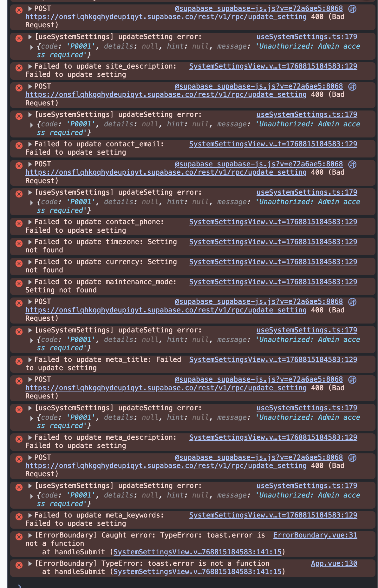

# ✅ ศูนย์กลางการตั้งค่าแอดมิน - สรุปฉบับภาษาไทย

**วันที่**: 2026-01-19  
**สถานะ**: ✅ พร้อมพัฒนาฟีเจอร์ทีละตัว  
**ลำดับความสำคัญ**: 🎯 โครงสร้างพื้นฐานเสร็จสมบูรณ์

---

## 📋 สถานะปัจจุบัน

### ✅ สิ่งที่เสร็จแล้ว

1. **ศูนย์กลางการตั้งค่า** (`/admin/settings`)
   - หน้าหลักพร้อมระบบนำทางแบบการ์ด
   - แบ่งเป็น 5 หมวดหมู่หลัก
   - UI สะอาต ทันสมัย มี hover effects
   - รองรับทุกขนาดหน้าจอ

2. **การตั้งค่าทางการเงิน** (`/admin/settings/financial`) ✅ เสร็จสมบูรณ์
   - ตั้งค่าคอมมิชชั่น
   - ตั้งค่าการถอนเงิน
   - ตั้งค่าการเติมเงิน
   - ติดตามประวัติการเปลี่ยนแปลง (Audit Log)

3. **โครงสร้างเส้นทาง** - ทุกอย่างอยู่ภายใต้ `/admin/settings/*`

---

## 🗂️ หมวดหมู่การตั้งค่า (พร้อมพัฒนา)

### 1. ทั่วไป

- ⏳ **ทั่วไป** - `/admin/settings/system`
  - จัดการข้อมูลพื้นฐานของเว็บไซต์, SEO, ชื่อร้าน, การติดต่อ
- ⏳ **ธีม** - `/admin/settings/theme`
  - ปรับแต่งรูปลักษณ์และสีสันของแบรนด์
- ⏳ **ภาษา** - `/admin/settings/language`
  - ตั้งค่าภาษาและแปลเนื้อหา

### 2. หน้าแบบกำหนดเอง

- ⏳ **หน้าแบบกำหนดเอง** - `/admin/settings/custom-pages`
  - สร้างและจัดการหน้าเว็บแบบกำหนดเอง
- ⏳ **การนำรู้จักระบบ** - `/admin/settings/onboarding`
  - ตั้งค่าการแนะนำระบบให้ผู้ใช้ใหม่

### 3. การตั้งค่าการสั่งซื้อ



- ⏳ **การสั่งซื้อ** - `/admin/settings/orders`
  - กำหนดตัวเลือกและพฤติกรรมการสั่งซื้อ
- ✅ **วิธีการชำระเงิน** - `/admin/settings/financial`
  - ตั้งค่าวิธีการชำระเงิน (เสร็จสมบูรณ์)
- ⏳ **การแจ้งเตือน** - `/admin/settings/notifications`
  - ตั้งค่าการแจ้งเตือนสำหรับผู้ใช้, ผู้ให้บริการ, ลูกค้า
- ⏳ **การวิเคราะห์** - `/admin/settings/analytics`
  - ตั้งค่าการติดตามสถิติ
- ⏳ **การชำระเงิน** - `/admin/settings/payment-methods`
  - จัดการช่องทางการชำระเงิน

### 4. การเข้าถึงและความปลอดภัย

- ⏳ **ผู้ใช้และสิทธิ์** - `/admin/settings/users`
  - ควบคุมการเข้าถึงและจัดการแพลตฟอร์ม
- ⏳ **การยืนยันตัวตน** - `/admin/settings/security`
  - ตั้งค่าความปลอดภัยและการยืนยันตัวตน

### 5. การตั้งค่าแพลตฟอร์ม

- ⏳ **แอปมือถือ** - `/admin/settings/mobile-apps`
  - จัดการแอป iOS และ Android
- ⏳ **พื้นที่บริการ** - `/admin/settings/service-areas`
  - กำหนดพื้นที่ให้บริการ
- ⏳ **Google Maps** - `/admin/settings/maps`
  - ตั้งค่า Google Maps API
- ⏳ **โดเมน** - `/admin/settings/domains`
  - จัดการโดเมนและ white-label
- ⏳ **Webhooks & API** - `/admin/settings/webhooks`
  - ตั้งค่า webhooks และ API ภายนอก

---

## 📁 โครงสร้างไฟล์

```
src/admin/
├── views/
│   ├── AdminSettingsView.vue          # ✅ หน้าหลักศูนย์กลางการตั้งค่า
│   ├── AdminFinancialSettingsView.vue # ✅ การตั้งค่าทางการเงิน (เสร็จ)
│   └── SystemSettingsView.vue         # ⏳ Placeholder
├── components/
│   ├── SettingCard.vue                # ✅ คอมโพเนนต์การ์ดที่ใช้ซ้ำได้
│   ├── CommissionSettingsCard.vue     # ✅ ตั้งค่าคอมมิชชั่น
│   ├── WithdrawalSettingsCard.vue     # ✅ ตั้งค่าการถอนเงิน
│   ├── TopupSettingsCard.vue          # ✅ ตั้งค่าการเติมเงิน
│   └── SettingsAuditLogModal.vue      # ✅ ประวัติการเปลี่ยนแปลง
├── composables/
│   └── useFinancialSettings.ts        # ✅ Logic การตั้งค่าทางการเงิน
└── router.ts                          # ✅ เส้นทางทั้งหมดพร้อมแล้ว
```

---

## 🎨 ระบบดีไซน์

### คอมโพเนนต์ SettingCard

```vue
<SettingCard
  icon="💰"
  title="วิธีการชำระเงิน"
  description="เปิดใช้งานและตั้งค่าวิธีการชำระเงิน"
  @click="navigateTo('/admin/settings/financial')"
/>
```

**คุณสมบัติ:**

- ✅ ไอคอน + หัวข้อ + คำอธิบาย
- ✅ Hover effects (เปลี่ยนสีขอบ, เงา, เคลื่อนไหว)
- ✅ รองรับการเข้าถึง (accessible)
- ✅ ใช้งานง่ายบนมือถือ (touch-friendly)
- ✅ เรียงแบบ grid ที่ responsive

### โทนสี

- สีหลัก: `#3b82f6` (blue-500)
- ขอบเมื่อ hover: `#3b82f6` (blue-500)
- ข้อความ: `#111827` (gray-900)
- คำอธิบาย: `#6b7280` (gray-600)
- พื้นหลัง: `white`
- ขอบ: `#e5e7eb` (gray-200)

---

## 🚀 ขั้นตอนต่อไป

### เฟส 1: ปรับปรุง UX/UI (ปัจจุบัน)

1. ✅ โครงสร้างศูนย์กลางการตั้งค่าเสร็จแล้ว
2. ⏳ ตรวจสอบและปรับปรุง UX/UI ของแต่ละหน้าการตั้งค่า
3. ⏳ ให้แน่ใจว่าดีไซน์สอดคล้องกันทั้งหมด

### เฟส 2: พัฒนาฟีเจอร์ (ทีละตัว)

แต่ละฟีเจอร์จะพัฒนาทีละตัว:

1. **การตั้งค่าระบบ** (`/admin/settings/system`)
   - ชื่อเว็บไซต์, โลโก้, ข้อมูลติดต่อ
   - การตั้งค่า SEO
   - โหมดปิดปรับปรุง

2. **การตั้งค่าธีม** (`/admin/settings/theme`)
   - สีแบรนด์
   - อัปโหลดโลโก้
   - CSS แบบกำหนดเอง

3. **การตั้งค่าภาษา** (`/admin/settings/language`)
   - ภาษาที่รองรับ
   - ภาษาเริ่มต้น
   - จัดการการแปล

4. **หน้าแบบกำหนดเอง** (`/admin/settings/custom-pages`)
   - สร้าง/แก้ไขหน้าเว็บ
   - เทมเพลตหน้าเว็บ
   - จัดการเนื้อหา

5. **การนำรู้จักระบบ** (`/admin/settings/onboarding`)
   - ตั้งค่าขั้นตอนการแนะนำ
   - ขั้นตอนการสอนใช้งาน
   - หน้าจอต้อนรับ

... และอื่นๆ สำหรับแต่ละเมนู

---

## 📊 แนวทางการพัฒนา

### สำหรับแต่ละฟีเจอร์:

1. **ความต้องการ** - กำหนดสิ่งที่ฟีเจอร์ต้องการ
2. **ดีไซน์** - สร้าง UI/UX mockups
3. **ฐานข้อมูล** - สร้าง migrations ถ้าจำเป็น
4. **Backend** - RPC functions, RLS policies
5. **Frontend** - Vue components, composables
6. **การทดสอบ** - Unit tests, integration tests
7. **เอกสาร** - คู่มือผู้ใช้, API docs

### มาตรฐานที่ต้องปฏิบัติตาม:

- ✅ TypeScript strict mode
- ✅ Vue 3 Composition API
- ✅ Tailwind CSS สำหรับ styling
- ✅ รองรับการเข้าถึง (a11y)
- ✅ Mobile-first responsive design
- ✅ ควบคุมการเข้าถึงตามบทบาท (Role-based)
- ✅ ความปลอดภัย (Security best practices)
- ✅ ปรับแต่งประสิทธิภาพ (Performance optimization)

---

## 🎯 จุดเน้นปัจจุบัน

**สถานะ**: พร้อมเริ่มพัฒนาฟีเจอร์

**การกระทำต่อไป**: ผู้ใช้จะระบุว่าต้องการพัฒนาฟีเจอร์ไหนก่อน

**คำแนะนำ**: เริ่มจากฟีเจอร์ที่มีความสำคัญสูง:

1. การตั้งค่าระบบ (ตั้งค่าพื้นฐานของเว็บไซต์)
2. การตั้งค่าธีม (แบรนด์)
3. ปรับปรุงการตั้งค่าทางการเงิน (เสร็จแล้ว อาจต้องปรับแต่ง)

---

## 📝 หมายเหตุ

### ความสอดคล้องของดีไซน์

- ทุกหน้าการตั้งค่าควรใช้รูปแบบเลย์เอาต์เดียวกัน
- ใช้ระยะห่าง สี และตัวอักษรที่สอดคล้องกัน
- รักษาสไตล์การนำทางแบบการ์ด
- รองรับการใช้งานบนมือถือ

### ประสบการณ์ผู้ใช้

- หัวข้อส่วนที่ชัดเจน
- คำอธิบายที่เป็นประโยชน์สำหรับแต่ละการตั้งค่า
- ข้อเสนอแนะการตรวจสอบความถูกต้อง
- ข้อความสำเร็จ/ข้อผิดพลาด
- สถานะการโหลด
- กล่องยืนยันสำหรับการกระทำที่เป็นอันตราย

### ข้อพิจารณาทางเทคนิค

- การตั้งค่าทั้งหมดควรเก็บในฐานข้อมูล
- บันทึกการตรวจสอบสำหรับการเปลี่ยนแปลงทั้งหมด
- อัปเดตแบบเรียลไทม์ที่เหมาะสม
- จัดการข้อผิดพลาดอย่างเหมาะสม
- ความปลอดภัยของประเภทด้วย TypeScript

---

## 💡 สรุป

ศูนย์กลางการตั้งค่าแอดมินพร้อมใช้งานแล้ว! คุณสามารถ:

1. ✅ **เริ่มปรับปรุง UX/UI** สำหรับแต่ละหน้าการตั้งค่า
2. ✅ **พัฒนาฟีเจอร์ทีละตัว** - บอกฉันว่าต้องการเริ่มจากอันไหน
3. ✅ **รักษาความสอดคล้อง** ในทุกหน้าการตั้งค่า

**คุณต้องการพัฒนาฟีเจอร์ไหนก่อน?**

ตัวเลือกยอดนิยม:

- การตั้งค่าระบบ (ตั้งค่าพื้นฐานของเว็บไซต์)
- การตั้งค่าธีม (แบรนด์และสี)
- หรือปรับปรุงการตั้งค่าทางการเงินต่อ

---

**อัปเดตล่าสุด**: 2026-01-19  
**สถานะ**: ✅ โครงสร้างพื้นฐานเสร็จสมบูรณ์ - พร้อมพัฒนาฟีเจอร์
