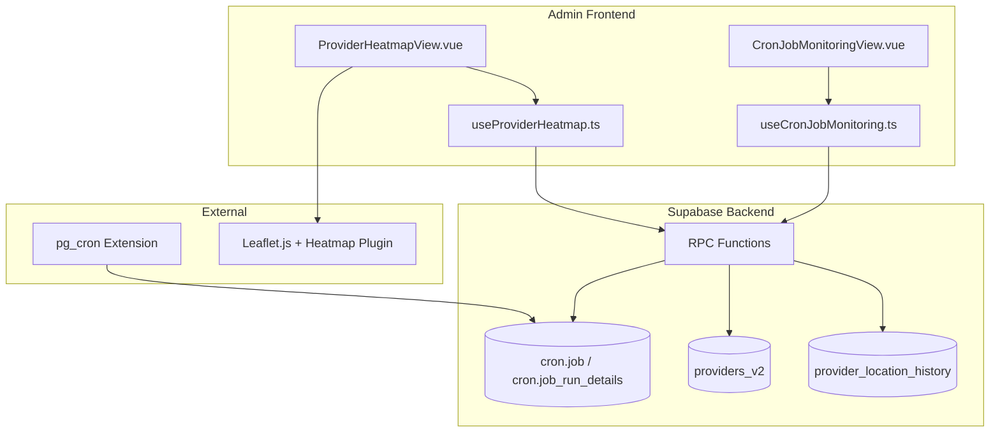

# Design Document: Admin Monitoring Features

## Overview

ระบบ Admin Monitoring Features ประกอบด้วย 2 ส่วนหลัก:

1. **Cron Job Monitoring Dashboard** - ติดตามสถานะและประวัติการทำงานของ pg_cron jobs
2. **Provider Location Heatmap** - แสดง heatmap ตำแหน่ง provider แบบ real-time

ระบบนี้ช่วยให้ Admin สามารถ:

- ตรวจสอบสุขภาพของ scheduled tasks
- วิเคราะห์การกระจายตัวของ provider
- ระบุพื้นที่ที่มี coverage ต่ำ
- ดู pattern การเคลื่อนที่ของ provider ตามเวลา

## Architecture



## Components and Interfaces

### 1. Cron Job Monitoring Components

#### CronJobMonitoringView.vue

หน้าหลักสำหรับแสดงข้อมูล cron jobs

```typescript
interface CronJob {
  jobid: number;
  jobname: string;
  schedule: string;
  command: string;
  nodename: string;
  nodeport: number;
  database: string;
  username: string;
  active: boolean;
  last_run_time: string | null;
  next_run_time: string | null;
}

interface CronJobRunDetail {
  runid: number;
  jobid: number;
  job_pid: number;
  database: string;
  username: string;
  command: string;
  status:
    | "starting"
    | "running"
    | "sending"
    | "connecting"
    | "succeeded"
    | "failed";
  return_message: string | null;
  start_time: string;
  end_time: string | null;
}

interface CronJobStats {
  total_jobs: number;
  active_jobs: number;
  failed_last_24h: number;
  succeeded_last_24h: number;
}
```

#### useCronJobMonitoring.ts

Composable สำหรับจัดการ cron job data

```typescript
interface UseCronJobMonitoringReturn {
  // State
  jobs: Ref<CronJob[]>;
  selectedJob: Ref<CronJob | null>;
  runHistory: Ref<CronJobRunDetail[]>;
  stats: Ref<CronJobStats>;
  loading: Ref<boolean>;
  error: Ref<string | null>;

  // Filters
  historyDateRange: Ref<{ start: Date; end: Date }>;
  historyStatusFilter: Ref<string | null>;

  // Actions
  loadJobs: () => Promise<void>;
  loadJobHistory: (jobId: number) => Promise<void>;
  runJobManually: (
    jobId: number
  ) => Promise<{ success: boolean; message: string }>;
  refreshStats: () => Promise<void>;
}
```

### 2. Provider Heatmap Components

#### ProviderHeatmapView.vue

หน้าแสดง heatmap ตำแหน่ง provider

```typescript
interface ProviderLocation {
  id: string;
  provider_type: string;
  current_lat: number;
  current_lng: number;
  is_online: boolean;
  is_available: boolean;
  last_updated: string;
}

interface HeatmapPoint {
  lat: number;
  lng: number;
  intensity: number; // 0-1
}

interface AreaStats {
  name: string;
  center: { lat: number; lng: number };
  provider_count: number;
  coverage_level: "high" | "medium" | "low";
}

interface HeatmapFilters {
  provider_type: string | null;
  is_online: boolean | null;
  time_range: { start: Date; end: Date } | null;
}
```

#### useProviderHeatmap.ts

Composable สำหรับจัดการ heatmap data

```typescript
interface UseProviderHeatmapReturn {
  // State
  providers: Ref<ProviderLocation[]>;
  heatmapPoints: Ref<HeatmapPoint[]>;
  stats: Ref<{
    total: number;
    online: number;
    available: number;
  }>;
  highDensityAreas: Ref<AreaStats[]>;
  lowDensityAreas: Ref<AreaStats[]>;
  loading: Ref<boolean>;
  error: Ref<string | null>;

  // Filters
  filters: Ref<HeatmapFilters>;

  // Time-lapse
  isTimeLapseMode: Ref<boolean>;
  timeLapseDuration: Ref<"1h" | "6h" | "24h">;
  timeLapseProgress: Ref<number>;
  currentTimestamp: Ref<Date>;

  // Actions
  loadProviders: () => Promise<void>;
  applyFilters: (filters: HeatmapFilters) => void;
  startTimeLapse: () => void;
  pauseTimeLapse: () => void;
  setTimeLapseSpeed: (speed: number) => void;
  getAreaDetails: (lat: number, lng: number) => Promise<AreaStats>;
}
```

## Data Models

### Database Tables

#### cron.job (pg_cron built-in)

```sql
-- pg_cron extension table (read-only from app)
-- Contains scheduled job definitions
```

#### cron.job_run_details (pg_cron built-in)

```sql
-- pg_cron extension table (read-only from app)
-- Contains execution history
```

#### provider_location_history (existing)

```sql
-- Already exists in the system
-- Used for time-lapse and historical analysis
```

### RPC Functions

#### get_cron_jobs_with_stats()

```sql
CREATE OR REPLACE FUNCTION get_cron_jobs_with_stats()
RETURNS TABLE (
  jobid bigint,
  jobname text,
  schedule text,
  command text,
  active boolean,
  last_run_time timestamptz,
  next_run_time timestamptz,
  last_status text,
  failed_count_24h bigint,
  success_count_24h bigint
)
LANGUAGE plpgsql
SECURITY DEFINER
AS $$
BEGIN
  RETURN QUERY
  SELECT
    j.jobid,
    j.jobname,
    j.schedule,
    j.command,
    j.active,
    (SELECT MAX(start_time) FROM cron.job_run_details WHERE jobid = j.jobid) as last_run_time,
    -- Calculate next run based on schedule (simplified)
    NULL::timestamptz as next_run_time,
    (SELECT status FROM cron.job_run_details WHERE jobid = j.jobid ORDER BY start_time DESC LIMIT 1) as last_status,
    (SELECT COUNT(*) FROM cron.job_run_details
     WHERE jobid = j.jobid AND status = 'failed'
     AND start_time > NOW() - INTERVAL '24 hours') as failed_count_24h,
    (SELECT COUNT(*) FROM cron.job_run_details
     WHERE jobid = j.jobid AND status = 'succeeded'
     AND start_time > NOW() - INTERVAL '24 hours') as success_count_24h
  FROM cron.job j
  ORDER BY j.jobname;
END;
$$;
```

#### get_cron_job_history()

```sql
CREATE OR REPLACE FUNCTION get_cron_job_history(
  p_job_id bigint,
  p_start_date timestamptz DEFAULT NULL,
  p_end_date timestamptz DEFAULT NULL,
  p_status text DEFAULT NULL,
  p_limit int DEFAULT 50
)
RETURNS TABLE (
  runid bigint,
  jobid bigint,
  status text,
  return_message text,
  start_time timestamptz,
  end_time timestamptz,
  duration_seconds numeric
)
LANGUAGE plpgsql
SECURITY DEFINER
AS $$
BEGIN
  RETURN QUERY
  SELECT
    r.runid,
    r.jobid,
    r.status,
    r.return_message,
    r.start_time,
    r.end_time,
    EXTRACT(EPOCH FROM (r.end_time - r.start_time)) as duration_seconds
  FROM cron.job_run_details r
  WHERE r.jobid = p_job_id
    AND (p_start_date IS NULL OR r.start_time >= p_start_date)
    AND (p_end_date IS NULL OR r.start_time <= p_end_date)
    AND (p_status IS NULL OR r.status = p_status)
  ORDER BY r.start_time DESC
  LIMIT p_limit;
END;
$$;
```

#### run_cron_job_manually()

```sql
CREATE OR REPLACE FUNCTION run_cron_job_manually(p_job_name text)
RETURNS jsonb
LANGUAGE plpgsql
SECURITY DEFINER
AS $$
DECLARE
  v_job_record RECORD;
  v_result jsonb;
BEGIN
  -- Get job details
  SELECT * INTO v_job_record FROM cron.job WHERE jobname = p_job_name;

  IF NOT FOUND THEN
    RETURN jsonb_build_object('success', false, 'message', 'Job not found');
  END IF;

  -- Execute the command
  BEGIN
    EXECUTE v_job_record.command;
    v_result := jsonb_build_object('success', true, 'message', 'Job executed successfully');
  EXCEPTION WHEN OTHERS THEN
    v_result := jsonb_build_object('success', false, 'message', SQLERRM);
  END;

  RETURN v_result;
END;
$$;
```

#### get_provider_heatmap_data()

```sql
CREATE OR REPLACE FUNCTION get_provider_heatmap_data(
  p_provider_type text DEFAULT NULL,
  p_is_online boolean DEFAULT NULL,
  p_start_time timestamptz DEFAULT NULL,
  p_end_time timestamptz DEFAULT NULL
)
RETURNS TABLE (
  lat double precision,
  lng double precision,
  provider_count bigint,
  intensity double precision
)
LANGUAGE plpgsql
SECURITY DEFINER
AS $$
BEGIN
  -- If time range specified, use location history
  IF p_start_time IS NOT NULL AND p_end_time IS NOT NULL THEN
    RETURN QUERY
    SELECT
      ROUND(h.latitude::numeric, 3)::double precision as lat,
      ROUND(h.longitude::numeric, 3)::double precision as lng,
      COUNT(DISTINCT h.provider_id) as provider_count,
      LEAST(COUNT(DISTINCT h.provider_id)::double precision / 10.0, 1.0) as intensity
    FROM provider_location_history h
    INNER JOIN providers_v2 p ON p.id = h.provider_id
    WHERE h.recorded_at BETWEEN p_start_time AND p_end_time
      AND (p_provider_type IS NULL OR p.provider_type = p_provider_type)
      AND p.status = 'approved'
    GROUP BY ROUND(h.latitude::numeric, 3), ROUND(h.longitude::numeric, 3);
  ELSE
    -- Use current locations
    RETURN QUERY
    SELECT
      ROUND(p.current_lat::numeric, 3)::double precision as lat,
      ROUND(p.current_lng::numeric, 3)::double precision as lng,
      COUNT(*) as provider_count,
      LEAST(COUNT(*)::double precision / 10.0, 1.0) as intensity
    FROM providers_v2 p
    WHERE p.current_lat IS NOT NULL
      AND p.current_lng IS NOT NULL
      AND p.status = 'approved'
      AND (p_provider_type IS NULL OR p.provider_type = p_provider_type)
      AND (p_is_online IS NULL OR p.is_online = p_is_online)
    GROUP BY ROUND(p.current_lat::numeric, 3), ROUND(p.current_lng::numeric, 3);
  END IF;
END;
$$;
```

#### get_provider_density_areas()

```sql
CREATE OR REPLACE FUNCTION get_provider_density_areas(
  p_limit int DEFAULT 5
)
RETURNS TABLE (
  area_name text,
  center_lat double precision,
  center_lng double precision,
  provider_count bigint,
  coverage_level text,
  is_high_density boolean
)
LANGUAGE plpgsql
SECURITY DEFINER
AS $$
BEGIN
  RETURN QUERY
  WITH area_stats AS (
    SELECT
      ROUND(p.current_lat::numeric, 2)::double precision as lat,
      ROUND(p.current_lng::numeric, 2)::double precision as lng,
      COUNT(*) as cnt
    FROM providers_v2 p
    WHERE p.current_lat IS NOT NULL
      AND p.current_lng IS NOT NULL
      AND p.status = 'approved'
      AND p.is_online = true
    GROUP BY ROUND(p.current_lat::numeric, 2), ROUND(p.current_lng::numeric, 2)
  ),
  ranked AS (
    SELECT
      lat, lng, cnt,
      CASE
        WHEN cnt >= 5 THEN 'high'
        WHEN cnt >= 2 THEN 'medium'
        ELSE 'low'
      END as level,
      ROW_NUMBER() OVER (ORDER BY cnt DESC) as high_rank,
      ROW_NUMBER() OVER (ORDER BY cnt ASC) as low_rank
    FROM area_stats
  )
  SELECT
    CONCAT('Area ', lat::text, ',', lng::text) as area_name,
    lat as center_lat,
    lng as center_lng,
    cnt as provider_count,
    level as coverage_level,
    high_rank <= p_limit as is_high_density
  FROM ranked
  WHERE high_rank <= p_limit OR low_rank <= p_limit
  ORDER BY cnt DESC;
END;
$$;
```

## Correctness Properties

_A property is a characteristic or behavior that should hold true across all valid executions of a system-essentially, a formal statement about what the system should do. Properties serve as the bridge between human-readable specifications and machine-verifiable correctness guarantees._

### Property 1: Cron Job Display Completeness

_For any_ cron job data returned from the database, the rendered job card SHALL display all required fields: job name, schedule, last run time, next run time, and status.

**Validates: Requirements 1.2**

### Property 2: Cron Job Statistics Accuracy

_For any_ set of cron job execution records, the calculated statistics (active count, failed count in 24h, success count in 24h) SHALL match the actual counts from the raw data.

**Validates: Requirements 1.4**

### Property 3: Execution History Display Completeness

_For any_ cron job execution record, the rendered history row SHALL display all required fields: start time, end time, duration, status, and return value.

**Validates: Requirements 2.2**

### Property 4: Execution History Filtering

_For any_ set of execution records and any combination of date range and status filters, the filtered results SHALL contain only records that match ALL applied filter criteria.

**Validates: Requirements 2.4**

### Property 5: Concurrent Execution Prevention

_For any_ cron job, if a manual execution is in progress, subsequent manual execution requests for the same job SHALL be rejected until the first execution completes.

**Validates: Requirements 3.3**

### Property 6: Heatmap Color Intensity Mapping

_For any_ provider density value, the assigned color SHALL correctly represent the density level: red for high (>= 5 providers), yellow for medium (2-4 providers), green for low (1 provider).

**Validates: Requirements 4.2**

### Property 7: Provider Filtering Correctness

_For any_ combination of provider type, online status, and time range filters, the filtered provider set SHALL contain only providers that match ALL applied filter criteria simultaneously.

**Validates: Requirements 5.1, 5.2, 5.3, 5.4**

### Property 8: Provider Statistics Accuracy

_For any_ set of provider data, the calculated statistics (total count, online count, available count) SHALL match the actual counts from the raw data.

**Validates: Requirements 6.1**

### Property 9: Low Coverage Area Detection

_For any_ geographic area with provider count below the defined threshold, the system SHALL identify and include that area in the low-coverage list.

**Validates: Requirements 6.2**

### Property 10: Density Area Ranking

_For any_ set of geographic areas with provider data, the top 5 high-density areas SHALL be correctly ranked by provider count in descending order, and the top 5 low-density areas SHALL be correctly ranked by provider count in ascending order.

**Validates: Requirements 6.4**

## Error Handling

### Cron Job Monitoring Errors

| Error Type              | Handling Strategy                    |
| ----------------------- | ------------------------------------ |
| pg_cron not installed   | แสดงข้อความแนะนำให้ติดตั้ง extension |
| Permission denied       | แสดงข้อความว่าต้องเป็น admin         |
| Job not found           | แสดง toast error และ refresh list    |
| Manual execution failed | แสดง error message จาก database      |
| Network timeout         | แสดง retry button                    |

### Heatmap Errors

| Error Type               | Handling Strategy                      |
| ------------------------ | -------------------------------------- |
| No location data         | แสดง empty state พร้อมคำแนะนำ          |
| Map load failed          | แสดง fallback message และ retry button |
| Realtime connection lost | แสดง warning และ auto-reconnect        |
| Filter returns empty     | แสดง "ไม่พบข้อมูลตามเงื่อนไข"          |

## Testing Strategy

### Unit Tests

ใช้ Vitest สำหรับทดสอบ:

- Composable functions (useCronJobMonitoring, useProviderHeatmap)
- Utility functions (color mapping, statistics calculation)
- Filter logic

### Property-Based Tests

ใช้ fast-check สำหรับทดสอบ correctness properties:

- ทุก property test ต้องรันอย่างน้อย 100 iterations
- ใช้ generators สำหรับสร้าง random test data
- Tag format: **Feature: admin-monitoring-features, Property {number}: {property_text}**

### Integration Tests

- ทดสอบ RPC functions กับ database จริง
- ทดสอบ realtime subscription
- ทดสอบ map rendering กับ Leaflet

### Test Configuration

```typescript
// vitest.config.ts
export default defineConfig({
  test: {
    environment: "jsdom",
    globals: true,
    coverage: {
      provider: "v8",
      reporter: ["text", "json", "html"],
    },
  },
});
```

### Property Test Example

```typescript
import { fc } from "fast-check";
import { describe, it, expect } from "vitest";

describe("Provider Filtering", () => {
  // Feature: admin-monitoring-features, Property 7: Provider Filtering Correctness
  it("should filter providers correctly for any combination of filters", () => {
    fc.assert(
      fc.property(
        fc.array(providerArbitrary, { minLength: 0, maxLength: 100 }),
        fc.record({
          provider_type: fc.option(
            fc.constantFrom("driver", "rider", "shopper")
          ),
          is_online: fc.option(fc.boolean()),
        }),
        (providers, filters) => {
          const result = filterProviders(providers, filters);

          return result.every((p) => {
            if (
              filters.provider_type &&
              p.provider_type !== filters.provider_type
            )
              return false;
            if (filters.is_online !== null && p.is_online !== filters.is_online)
              return false;
            return true;
          });
        }
      ),
      { numRuns: 100 }
    );
  });
});
```
