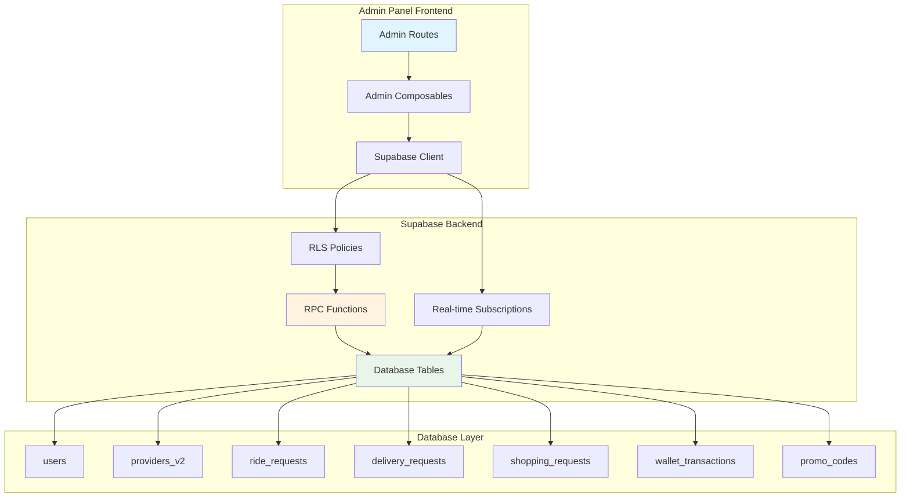
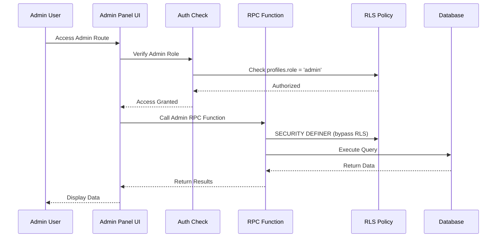

# Design Document: Admin Panel Complete Verification and Database Setup

## Overview

This design document outlines the complete verification and database setup for the Admin Panel system. The system provides 20 administrative routes for managing users, orders, finances, marketing, and system monitoring. The design focuses on ensuring all database tables, RPC functions, and RLS policies are properly configured to support 100% operational status for all admin features.

### Key Design Goals

1. **Complete Database Coverage**: Ensure all tables and RPC functions exist for admin operations
2. **Security First**: Implement proper RLS policies with admin role verification
3. **Performance Optimized**: Use indexes, SELECT wrappers, and efficient queries
4. **Dual-Role Support**: Properly handle providers_v2.user_id architecture
5. **Real-Time Capable**: Support Supabase real-time subscriptions for live updates
6. **Maintainable**: Clear migration files with rollback support

### Technology Stack

- **Database**: PostgreSQL 16 via Supabase
- **Backend**: Supabase Edge Functions, RPC Functions
- **Frontend**: Vue 3.5+, TypeScript 5.9+, Pinia 2.2+
- **Real-Time**: Supabase Real-time subscriptions
- **Development**: Supabase Local with Docker

## Architecture

### System Architecture



### Data Flow Architecture



### Dual-Role System Architecture

The system uses a dual-role architecture for providers:

```
auth.users (id: UUID)
    ↓
profiles (user_id: UUID, role: 'customer'|'provider'|'admin')
    ↓
providers_v2 (id: UUID, user_id: UUID)
```

**Critical Rule**: When checking provider access, ALWAYS join through `providers_v2.user_id = auth.uid()`, NEVER compare `provider_id` directly with `auth.uid()`.

## Components and Interfaces

### 1. Database Tables

#### Core Tables (Already Exist)

- **users**: User accounts and authentication
- **profiles**: User profiles with role information
- **providers_v2**: Provider records with user_id linkage
- **ride_requests**: Ride service orders
- **delivery_requests**: Delivery service orders
- **shopping_requests**: Shopping service orders
- **wallet_transactions**: Financial transactions
- **promo_codes**: Promotional codes
- **provider_location_history**: Historical location tracking
- **push_notification_logs**: Push notification tracking

#### Required Indexes

```sql
-- Performance indexes for admin queries
CREATE INDEX CONCURRENTLY IF NOT EXISTS idx_ride_requests_status
  ON ride_requests(status);
CREATE INDEX CONCURRENTLY IF NOT EXISTS idx_ride_requests_created
  ON ride_requests(created_at DESC);
CREATE INDEX CONCURRENTLY IF NOT EXISTS idx_providers_v2_status
  ON providers_v2(status);
CREATE INDEX CONCURRENTLY IF NOT EXISTS idx_providers_v2_online
  ON providers_v2(is_online) WHERE is_online = true;
CREATE INDEX CONCURRENTLY IF NOT EXISTS idx_wallet_transactions_user
  ON wallet_transactions(user_id, created_at DESC);
```

### 2. RPC Functions

#### Priority 1: Critical Functions

**get_admin_dashboard_stats()**

- **Purpose**: Retrieve overall system statistics for dashboard
- **Returns**: JSON with user counts, order counts, revenue totals
- **Security**: SECURITY DEFINER, admin role check
- **Status**: ✅ Exists (migration 250)

**get_admin_customers()**

- **Purpose**: Retrieve customer list with filters and search
- **Parameters**: search_term, status, limit, offset
- **Returns**: TABLE with customer details
- **Security**: SECURITY DEFINER, admin role check
- **Status**: ❌ Needs Creation

**get_admin_providers_v2()**

- **Purpose**: Retrieve provider list with status and verification info
- **Parameters**: status, provider_type, limit, offset
- **Returns**: TABLE with provider details
- **Security**: SECURITY DEFINER, admin role check
- **Status**: ❌ Needs Creation

**get_admin_orders()**

- **Purpose**: Retrieve all orders across service types
- **Parameters**: service_type, status, limit, offset, search, date_from, date_to
- **Returns**: TABLE with order details including evidence photos
- **Security**: SECURITY DEFINER, admin role check
- **Status**: ✅ Exists (migration 295)

**get_active_providers_locations()**

- **Purpose**: Retrieve real-time provider locations for map
- **Returns**: TABLE with provider location and status
- **Security**: SECURITY DEFINER, admin role check
- **Status**: ✅ Exists (migration 251)

#### Priority 2: Service-Specific Functions

**get_admin_delivery_orders()**

- **Purpose**: Retrieve delivery orders with specific fields
- **Parameters**: status, limit, offset
- **Returns**: TABLE with delivery order details
- **Security**: SECURITY DEFINER, admin role check
- **Status**: ✅ Exists (migration 250)

**get_admin_shopping_orders()**

- **Purpose**: Retrieve shopping orders with specific fields
- **Parameters**: status, limit, offset
- **Returns**: TABLE with shopping order details
- **Security**: SECURITY DEFINER, admin role check
- **Status**: ✅ Exists (migration 250)

**get_scheduled_rides()**

- **Purpose**: Retrieve scheduled rides for future dates
- **Parameters**: date_from, date_to, limit, offset
- **Returns**: TABLE with scheduled ride details
- **Security**: SECURITY DEFINER, admin role check
- **Status**: ❌ Needs Creation

**get_provider_withdrawals_admin()**

- **Purpose**: Retrieve provider withdrawal requests
- **Parameters**: status, limit, offset
- **Returns**: TABLE with withdrawal request details
- **Security**: SECURITY DEFINER, admin role check
- **Status**: ❌ Needs Creation

**get_topup_requests_admin()**

- **Purpose**: Retrieve customer topup requests
- **Parameters**: status, limit, offset
- **Returns**: TABLE with topup request details
- **Security**: SECURITY DEFINER, admin role check
- **Status**: ❌ Needs Creation

#### Priority 3: Analytics Functions

**get_admin_revenue_stats()**

- **Purpose**: Calculate revenue statistics with date ranges
- **Parameters**: date_from, date_to, service_type
- **Returns**: JSON with revenue breakdown
- **Security**: SECURITY DEFINER, admin role check
- **Status**: ❌ Needs Creation

**get_admin_payment_stats()**

- **Purpose**: Calculate payment statistics and trends
- **Parameters**: date_from, date_to
- **Returns**: JSON with payment analytics
- **Security**: SECURITY DEFINER, admin role check
- **Status**: ❌ Needs Creation

**get_push_analytics()**

- **Purpose**: Retrieve push notification analytics
- **Returns**: JSON with notification metrics
- **Security**: SECURITY DEFINER, admin role check
- **Status**: ✅ Exists (migration 289)

**get_cron_job_stats()**

- **Purpose**: Retrieve cron job execution statistics
- **Returns**: TABLE with job execution history
- **Security**: SECURITY DEFINER, admin role check
- **Status**: ✅ Exists (migration 278)

**get_provider_heatmap_data()**

- **Purpose**: Retrieve provider location density data
- **Parameters**: provider_type, is_online, start_time, end_time
- **Returns**: TABLE with location aggregates
- **Security**: SECURITY DEFINER, admin role check
- **Status**: ✅ Exists (migration 279)

### 3. RLS Policies

#### Admin Access Pattern

All admin RLS policies follow this pattern:

```sql
-- Admin full access policy
CREATE POLICY "admin_full_access" ON table_name
  FOR ALL TO authenticated
  USING (
    EXISTS (
      SELECT 1 FROM profiles
      WHERE profiles.id = (SELECT auth.uid())
      AND profiles.role = 'admin'
    )
  );
```

**Performance Optimization**: Use SELECT wrapper for auth.uid() caching:

```sql
-- Optimized version
CREATE POLICY "admin_full_access_optimized" ON table_name
  FOR ALL TO authenticated
  USING (
    EXISTS (
      SELECT 1 FROM profiles
      WHERE profiles.id = (SELECT auth.uid())  -- Cached
      AND profiles.role = 'admin'
    )
  );
```

#### Dual-Role Policy Pattern

For provider-related tables, use dual-role pattern:

```sql
-- Provider access through providers_v2.user_id
CREATE POLICY "provider_own_data" ON ride_requests
  FOR SELECT TO authenticated
  USING (
    EXISTS (
      SELECT 1 FROM providers_v2
      WHERE providers_v2.id = ride_requests.provider_id
      AND providers_v2.user_id = (SELECT auth.uid())
    )
  );
```

### 4. Admin Route Components

#### Dashboard Routes

**AdminDashboardView.vue**

- Displays: Total users, providers, orders, revenue
- Real-time: Active providers, pending orders
- Charts: Revenue trends, order breakdown
- Composable: `useAdminDashboard()`
- RPC: `get_admin_dashboard_stats()`, `get_realtime_order_stats()`

#### User Management Routes

**AdminCustomersView.vue**

- Features: List, search, filter, suspend/unsuspend
- Composable: `useAdminCustomers()`
- RPC: `get_admin_customers()`

**AdminProvidersView.vue**

- Features: List, approve/reject, view documents
- Composable: `useAdminProviders()`
- RPC: `get_admin_providers_v2()`

**AdminVerificationQueueView.vue**

- Features: Document review, approve/reject
- Composable: `useAdminVerification()`
- RPC: `get_admin_providers_v2()` with status filter

#### Order Management Routes

**AdminOrdersView.vue**

- Features: All orders, filters, search, evidence photos
- Composable: `useAdminOrders()`
- RPC: `get_admin_orders()`

**AdminDeliveryView.vue**

- Features: Delivery orders only
- Composable: `useAdminDelivery()`
- RPC: `get_admin_delivery_orders()`

**AdminShoppingView.vue**

- Features: Shopping orders only
- Composable: `useAdminShopping()`
- RPC: `get_admin_shopping_orders()`

**AdminDriverTrackingView.vue**

- Features: Real-time map, provider locations
- Composable: `useAdminDriverTracking()`
- RPC: `get_active_providers_locations()`
- Real-time: Subscribe to provider location updates

**AdminScheduledRidesView.vue**

- Features: Future scheduled rides
- Composable: `useAdminScheduledRides()`
- RPC: `get_scheduled_rides()`

#### Financial Routes

**AdminRevenueView.vue**

- Features: Revenue charts, breakdown by service
- Composable: `useAdminRevenue()`
- RPC: `get_admin_revenue_stats()`

**AdminPaymentsView.vue**

- Features: Payment transactions, refunds
- Composable: `useAdminPayments()`
- RPC: `get_admin_payment_stats()`

**AdminWithdrawalsView.vue**

- Features: Provider withdrawal requests, approve/reject
- Composable: `useAdminWithdrawals()`
- RPC: `get_provider_withdrawals_admin()`

**AdminTopupRequestsView.vue**

- Features: Customer topup requests, approve/reject
- Composable: `useAdminTopup()`
- RPC: `get_topup_requests_admin()`

#### Marketing Routes

**AdminPromosView.vue**

- Features: Promo code management, create/edit/activate
- Composable: `useAdminPromos()`
- Direct table access with RLS

#### Analytics Routes

**AdminAnalyticsView.vue**

- Features: General usage statistics
- Composable: `useAdminAnalytics()`
- Multiple RPC calls

**AdminPushAnalyticsView.vue**

- Features: Push notification metrics
- Composable: `usePushAnalytics()`
- RPC: `get_push_analytics()`

**AdminCronJobsView.vue**

- Features: Cron job monitoring
- Composable: `useCronJobMonitoring()`
- RPC: `get_cron_job_stats()`

**AdminProviderHeatmapView.vue**

- Features: Provider location heatmap
- Composable: `useProviderHeatmap()`
- RPC: `get_provider_heatmap_data()`

#### Settings Routes

**AdminSettingsView.vue**

- Features: System configuration
- Composable: `useAdminSettings()`
- Direct table access

**AdminSystemHealthView.vue**

- Features: System logs, health checks
- Composable: `useAdminSystemHealth()`
- Database monitoring queries

## Data Models

### Admin Dashboard Stats Model

```typescript
interface AdminDashboardStats {
  totalCustomers: number;
  totalProviders: number;
  activeProviders: number;
  pendingProviders: number;
  totalOrders: number;
  pendingOrders: number;
  todayOrders: number;
  todayRevenue: number;
  totalRevenue: number;
}
```

### Admin Order Model

```typescript
interface AdminOrder {
  id: string;
  tracking_id: string;
  service_type: "ride" | "delivery" | "shopping";
  status: string;
  priority: "normal" | "urgent" | "scheduled" | "high_value";
  user_id: string;
  user_name: string;
  user_phone: string;
  user_email: string;
  provider_id: string | null;
  provider_name: string;
  provider_phone: string | null;
  provider_rating: number | null;
  pickup_address: string;
  pickup_lat: number;
  pickup_lng: number;
  dropoff_address: string;
  dropoff_lat: number;
  dropoff_lng: number;
  estimated_amount: number;
  final_amount: number | null;
  payment_method: string;
  payment_status: string;
  promo_code: string | null;
  promo_discount: number;
  distance_km: number | null;
  duration_minutes: number | null;
  special_notes: string | null;
  created_at: string;
  matched_at: string | null;
  started_at: string | null;
  completed_at: string | null;
  cancelled_at: string | null;
  cancel_reason: string | null;
  cancelled_by: string | null;
  rating: number | null;
  feedback: string | null;
  last_updated: string;
  pickup_photo: string | null;
  dropoff_photo: string | null;
  arrived_at: string | null;
}
```

### Admin Customer Model

```typescript
interface AdminCustomer {
  id: string;
  email: string;
  full_name: string;
  phone_number: string;
  status: "active" | "suspended" | "banned";
  wallet_balance: number;
  total_orders: number;
  total_spent: number;
  average_rating: number;
  created_at: string;
  last_order_at: string | null;
  suspension_reason: string | null;
  suspended_at: string | null;
  suspended_by: string | null;
}
```

### Admin Provider Model

```typescript
interface AdminProvider {
  id: string;
  user_id: string;
  provider_uid: string;
  email: string;
  first_name: string;
  last_name: string;
  phone_number: string;
  provider_type: "ride" | "delivery" | "shopping" | "all";
  status: "pending" | "approved" | "rejected" | "suspended";
  is_online: boolean;
  is_available: boolean;
  current_lat: number | null;
  current_lng: number | null;
  rating: number;
  total_trips: number;
  total_earnings: number;
  wallet_balance: number;
  documents_verified: boolean;
  verification_notes: string | null;
  created_at: string;
  approved_at: string | null;
  approved_by: string | null;
  last_active_at: string | null;
}
```

### Provider Location Model

```typescript
interface ProviderLocation {
  id: string;
  provider_uid: string;
  provider_type: string;
  user_name: string;
  phone_number: string;
  current_lat: number;
  current_lng: number;
  is_online: boolean;
  rating: number;
  total_trips: number;
  last_updated: string;
}
```

### Withdrawal Request Model

```typescript
interface WithdrawalRequest {
  id: string;
  provider_id: string;
  provider_name: string;
  provider_phone: string;
  amount: number;
  bank_account: string;
  bank_name: string;
  account_holder: string;
  status: "pending" | "approved" | "rejected" | "completed";
  requested_at: string;
  processed_at: string | null;
  processed_by: string | null;
  rejection_reason: string | null;
  transaction_id: string | null;
}
```

### Topup Request Model

```typescript
interface TopupRequest {
  id: string;
  user_id: string;
  user_name: string;
  user_phone: string;
  amount: number;
  payment_method: string;
  payment_reference: string;
  payment_proof_url: string | null;
  status: "pending" | "approved" | "rejected";
  requested_at: string;
  processed_at: string | null;
  processed_by: string | null;
  rejection_reason: string | null;
}
```

### Revenue Stats Model

```typescript
interface RevenueStats {
  total_revenue: number;
  ride_revenue: number;
  delivery_revenue: number;
  shopping_revenue: number;
  platform_fee: number;
  provider_earnings: number;
  daily_breakdown: Array<{
    date: string;
    revenue: number;
    orders: number;
  }>;
  payment_method_breakdown: {
    cash: number;
    wallet: number;
    card: number;
  };
}
```

## Correctness Properties

_A property is a characteristic or behavior that should hold true across all valid executions of a system—essentially, a formal statement about what the system should do. Properties serve as the bridge between human-readable specifications and machine-verifiable correctness guarantees._

### Property Reflection

After analyzing all acceptance criteria, I identified the following redundancies:

- **Redundancy 1**: Requirements 5.3 and 15.3 both test that admin role is verified from profiles table - these can be combined into one property
- **Redundancy 2**: Requirement 1.4 and 14.5 both test for database indexes - 14.5 is redundant
- **Redundancy 3**: Multiple UI route tests (7.1-7.4, 8.1-8.6, 9.1-9.6, etc.) test similar patterns of "route loads and displays data" - these can be consolidated into fewer comprehensive properties

The following properties have been consolidated or removed:

- Combined 5.3 and 15.3 into single "Admin role verification" property
- Removed 14.5 as duplicate of 1.4
- Consolidated individual route tests into general "Admin route functionality" properties

### Database Schema Properties

**Property 1: Required Tables Existence**
_For any_ deployment of the system, querying information_schema.tables should return all required admin tables including users, profiles, providers_v2, ride_requests, delivery_requests, shopping_requests, wallet_transactions, and promo_codes.
**Validates: Requirements 1.1**

**Property 2: Schema Correctness**
_For any_ table in the system, querying information_schema.columns should show that column data types and constraints match the schema specification.
**Validates: Requirements 1.2**

**Property 3: Foreign Key Integrity**
_For any_ table with relationships, querying information_schema.table_constraints should show proper foreign key constraints exist for all referenced tables.
**Validates: Requirements 1.3**

**Property 4: Performance Indexes**
_For any_ frequently queried table, querying pg_indexes should show that indexes exist on columns used in WHERE clauses and JOIN conditions.
**Validates: Requirements 1.4**

### RLS Policy Properties

**Property 5: Admin Full Access**
_For any_ table with RLS enabled, when a user with admin role queries the table, the RLS policy should allow full read and write access.
**Validates: Requirements 5.1, 5.2**

**Property 6: Admin Role Verification**
_For any_ admin RLS policy, the policy definition should verify admin role by checking profiles.role = 'admin' where profiles.id = auth.uid().
**Validates: Requirements 5.3, 15.3**

**Property 7: SELECT Wrapper Optimization**
_For any_ RLS policy using auth.uid(), the policy should wrap it in SELECT (SELECT auth.uid()) for performance caching.
**Validates: Requirements 5.4**

**Property 8: Non-Admin Access Denial**
_For any_ admin-protected operation, when a non-admin user attempts access, the system should deny access and return appropriate error.
**Validates: Requirements 5.5, 15.1**

**Property 9: RLS Enabled on All Tables**
_For any_ table in the database, querying pg_tables should show that row level security is enabled (rls_enabled = true).
**Validates: Requirements 15.4**

### Dual-Role System Properties

**Property 10: Provider Query Join Pattern**
_For any_ query accessing provider data, the query should join through providers_v2.user_id rather than directly comparing provider_id with auth.uid().
**Validates: Requirements 6.1, 6.2**

**Property 11: No Direct Provider ID Comparison**
_For any_ RLS policy or query involving providers, scanning the SQL should not find direct comparisons of provider_id = auth.uid().
**Validates: Requirements 6.3**

**Property 12: Provider Data Access Resolution**
_For any_ provider user, when they query their own provider data, the system should correctly resolve their user_id to provider_id and return their data.
**Validates: Requirements 6.4**

**Property 13: Provider Record Integrity**
_For any_ new provider record inserted, the record should have a valid user_id that references an existing user in auth.users.
**Validates: Requirements 6.5**

### Input Validation Properties

**Property 14: Input Validation Before Database Operations**
_For any_ user input submitted to the system, the input should be validated against expected format and constraints before executing database operations.
**Validates: Requirements 15.5**

### Error Handling Properties

**Property 15: User-Friendly Error Messages**
_For any_ database operation that fails, the admin panel should catch the error and display a user-friendly error message rather than exposing technical details.
**Validates: Requirements 16.1**

**Property 16: RPC Error Display**
_For any_ RPC function that returns an error, the admin panel should extract and display the specific error message to the user.
**Validates: Requirements 16.2**

**Property 17: Network Failure Retry**
_For any_ network request that fails, the admin panel should display a retry option to the user.
**Validates: Requirements 16.3**

**Property 18: Success Confirmation**
_For any_ successful operation (create, update, delete), the admin panel should display a success confirmation message to the user.
**Validates: Requirements 16.4**

**Property 19: Error Logging**
_For any_ error that occurs, the admin panel should log the error to console with relevant context for debugging.
**Validates: Requirements 16.5**

### Pagination Properties

**Property 20: List Pagination**
_For any_ admin view displaying a list of items, the view should implement pagination with a default page size of 20 items.
**Validates: Requirements 14.4**

### Migration File Properties

**Property 21: Migration DROP IF EXISTS Pattern**
_For any_ migration file that modifies schema, the migration should include DROP IF EXISTS statements before CREATE statements to ensure idempotency.
**Validates: Requirements 17.2**

**Property 22: Policy Recreation Pattern**
_For any_ migration file that creates RLS policies, the migration should drop existing policies with the same name before creating new ones.
**Validates: Requirements 17.3**

**Property 23: Migration Documentation**
_For any_ migration file, the file should include header comments explaining the migration purpose, author, date, and changes.
**Validates: Requirements 17.4**

### Audit Logging Properties

**Property 24: Sensitive Operation Logging**
_For any_ sensitive admin operation (approve, reject, suspend, modify financial data), the system should create an audit log entry with timestamp, user ID, and action details.
**Validates: Requirements 15.2**

## Error Handling

### Error Categories

#### 1. Database Errors

**Connection Errors**

- Symptom: Cannot connect to Supabase
- Handling: Display "Database connection failed" message with retry button
- Logging: Log full error to console
- Recovery: Implement exponential backoff retry

**Query Errors**

- Symptom: RPC function returns error
- Handling: Parse error message and display user-friendly version
- Logging: Log query and error details
- Recovery: Suggest corrective action based on error type

**RLS Policy Errors**

- Symptom: "new row violates row-level security policy"
- Handling: Display "Access denied" message
- Logging: Log user ID and attempted operation
- Recovery: Verify user has admin role

#### 2. Authentication Errors

**Session Expired**

- Symptom: auth.uid() returns null
- Handling: Redirect to login page
- Logging: Log session expiration
- Recovery: User must re-authenticate

**Insufficient Permissions**

- Symptom: User role is not 'admin'
- Handling: Redirect to unauthorized page
- Logging: Log unauthorized access attempt
- Recovery: Contact admin for role assignment

#### 3. Validation Errors

**Invalid Input**

- Symptom: Input fails validation rules
- Handling: Display field-specific error messages
- Logging: Log validation failures
- Recovery: User corrects input

**Missing Required Fields**

- Symptom: Required field is empty
- Handling: Highlight missing fields
- Logging: Log incomplete submissions
- Recovery: User fills required fields

#### 4. Network Errors

**Request Timeout**

- Symptom: Request exceeds timeout limit
- Handling: Display "Request timed out" with retry
- Logging: Log timeout duration
- Recovery: Retry with exponential backoff

**Network Offline**

- Symptom: No network connection
- Handling: Display "No internet connection" banner
- Logging: Log offline state
- Recovery: Auto-retry when connection restored

### Error Handling Implementation

```typescript
// composables/useErrorHandler.ts
export function useErrorHandler() {
  const toast = useToast();

  function handleDatabaseError(error: PostgrestError) {
    console.error("[Database Error]", error);

    if (error.code === "PGRST301") {
      toast.error("Access denied. Admin privileges required.");
      router.push("/unauthorized");
    } else if (error.message.includes("violates row-level security")) {
      toast.error("You do not have permission to perform this action.");
    } else {
      toast.error("Database operation failed. Please try again.");
    }
  }

  function handleRPCError(error: any) {
    console.error("[RPC Error]", error);

    const message = error.message || "Operation failed";
    toast.error(message);
  }

  function handleNetworkError(error: Error) {
    console.error("[Network Error]", error);

    toast.error("Network request failed. Please check your connection.", {
      action: {
        label: "Retry",
        onClick: () => window.location.reload(),
      },
    });
  }

  return {
    handleDatabaseError,
    handleRPCError,
    handleNetworkError,
  };
}
```

### Error Recovery Strategies

**Automatic Retry**

- Network timeouts: 3 retries with exponential backoff
- Connection failures: Retry on reconnection
- Rate limit errors: Wait and retry after delay

**Manual Retry**

- Display retry button for user-initiated retry
- Preserve form state for retry attempts
- Clear error state on successful retry

**Graceful Degradation**

- Show cached data when real-time updates fail
- Display partial results when some queries fail
- Provide alternative actions when primary action fails

## Testing Strategy

### Dual Testing Approach

The testing strategy employs both unit tests and property-based tests to ensure comprehensive coverage:

**Unit Tests**: Focus on specific examples, edge cases, and integration points

- Verify specific RPC functions return expected data format
- Test individual component rendering and interactions
- Validate error handling for known error scenarios
- Test specific user workflows (e.g., approve provider, suspend customer)

**Property-Based Tests**: Verify universal properties across all inputs

- Test that all tables have RLS enabled
- Verify all admin policies allow admin access
- Test that dual-role pattern is used consistently
- Verify pagination works for any list size

### Property-Based Testing Configuration

**Library**: fast-check (TypeScript/JavaScript property-based testing library)

**Configuration**:

- Minimum 100 iterations per property test
- Each test tagged with feature name and property number
- Tag format: `Feature: admin-panel-complete-verification, Property {N}: {property_text}`

**Example Property Test**:

```typescript
// tests/admin-panel-rls.property.test.ts
import fc from "fast-check";
import { describe, it, expect } from "vitest";
import { createClient } from "@supabase/supabase-js";

describe("Feature: admin-panel-complete-verification, Property 9: RLS Enabled on All Tables", () => {
  it("should have RLS enabled on all tables", async () => {
    await fc.assert(
      fc.asyncProperty(
        fc.constantFrom(
          "users",
          "profiles",
          "providers_v2",
          "ride_requests",
          "delivery_requests",
          "shopping_requests",
          "wallet_transactions",
        ),
        async (tableName) => {
          const supabase = createClient(
            process.env.VITE_SUPABASE_URL!,
            process.env.VITE_SUPABASE_ANON_KEY!,
          );

          const { data, error } = await supabase
            .from("pg_tables")
            .select("rls_enabled")
            .eq("tablename", tableName)
            .eq("schemaname", "public")
            .single();

          expect(error).toBeNull();
          expect(data?.rls_enabled).toBe(true);
        },
      ),
      { numRuns: 100 },
    );
  });
});
```

### Unit Test Examples

**RPC Function Test**:

```typescript
// tests/admin-dashboard-stats.unit.test.ts
import { describe, it, expect, beforeEach } from "vitest";
import { useAdminDashboard } from "@/admin/composables/useAdminDashboard";

describe("Admin Dashboard Stats", () => {
  it("should fetch dashboard statistics", async () => {
    const { stats, fetchStats, loading, error } = useAdminDashboard();

    await fetchStats();

    expect(loading.value).toBe(false);
    expect(error.value).toBeNull();
    expect(stats.value).toHaveProperty("totalCustomers");
    expect(stats.value).toHaveProperty("totalProviders");
    expect(stats.value).toHaveProperty("totalOrders");
    expect(stats.value).toHaveProperty("totalRevenue");
  });

  it("should handle RPC errors gracefully", async () => {
    // Mock RPC error
    const { stats, fetchStats, error } = useAdminDashboard();

    // Simulate error condition
    await fetchStats();

    if (error.value) {
      expect(error.value).toContain("error");
      expect(stats.value).toBeNull();
    }
  });
});
```

**Component Test**:

```typescript
// tests/AdminCustomersView.unit.test.ts
import { describe, it, expect } from "vitest";
import { mount } from "@vue/test-utils";
import AdminCustomersView from "@/admin/views/AdminCustomersView.vue";

describe("AdminCustomersView", () => {
  it("should render customer list", async () => {
    const wrapper = mount(AdminCustomersView);

    // Wait for data to load
    await wrapper.vm.$nextTick();

    expect(wrapper.find('[data-test="customer-list"]').exists()).toBe(true);
    expect(wrapper.find('[data-test="search-input"]').exists()).toBe(true);
    expect(wrapper.find('[data-test="filter-select"]').exists()).toBe(true);
  });

  it("should implement pagination", () => {
    const wrapper = mount(AdminCustomersView);

    expect(wrapper.find('[data-test="pagination"]').exists()).toBe(true);
    expect(wrapper.vm.pageSize).toBe(20);
  });
});
```

### Integration Tests

**End-to-End Admin Workflow**:

```typescript
// tests/admin-provider-approval.integration.test.ts
import { describe, it, expect } from "vitest";
import { useAdminProviders } from "@/admin/composables/useAdminProviders";

describe("Provider Approval Workflow", () => {
  it("should approve pending provider", async () => {
    const { providers, fetchProviders, approveProvider } = useAdminProviders();

    // Fetch pending providers
    await fetchProviders({ status: "pending" });

    const pendingProvider = providers.value[0];
    expect(pendingProvider.status).toBe("pending");

    // Approve provider
    const result = await approveProvider(
      pendingProvider.id,
      "Approved - documents verified",
    );

    expect(result.success).toBe(true);

    // Verify status changed
    await fetchProviders({ status: "approved" });
    const approvedProvider = providers.value.find(
      (p) => p.id === pendingProvider.id,
    );
    expect(approvedProvider?.status).toBe("approved");
  });
});
```

### Performance Tests

**Page Load Performance**:

```typescript
// tests/admin-performance.test.ts
import { describe, it, expect } from "vitest";
import { mount } from "@vue/test-utils";
import AdminDashboardView from "@/admin/views/AdminDashboardView.vue";

describe("Admin Panel Performance", () => {
  it("should load dashboard within 2 seconds", async () => {
    const startTime = performance.now();

    const wrapper = mount(AdminDashboardView);
    await wrapper.vm.$nextTick();

    // Wait for all data to load
    await new Promise((resolve) => setTimeout(resolve, 100));

    const loadTime = performance.now() - startTime;

    // Note: This is a soft check, actual performance depends on network
    console.log(`Dashboard load time: ${loadTime}ms`);
    expect(loadTime).toBeLessThan(5000); // Allow 5s for test environment
  });
});
```

### Test Coverage Goals

- **Unit Tests**: 80% code coverage
- **Property Tests**: 100% coverage of correctness properties
- **Integration Tests**: All critical user workflows
- **Performance Tests**: All admin routes meet performance targets

### Continuous Testing

**Pre-commit Hooks**:

```bash
npm run lint          # 0 errors, 0 warnings
npm run type-check    # No TypeScript errors
npm run test -- --run # All tests pass
```

**CI/CD Pipeline**:

- Run all tests on pull requests
- Block merge if tests fail
- Generate coverage reports
- Performance regression detection

## Implementation Notes

### Development Workflow

1. **Activate Supabase MCP Power**

   ```
   kiroPowers(action="activate", powerName="supabase-local")
   ```

2. **Read Steering Guides**

   ```
   kiroPowers(action="readSteering", powerName="supabase-local",
              steeringFile="supabase-cli.md")
   kiroPowers(action="readSteering", powerName="supabase-local",
              steeringFile="supabase-local-database-workflow.md")
   ```

3. **Check Current Schema**

   ```
   kiroPowers(action="use", powerName="supabase-local",
              serverName="supabase", toolName="execute_sql",
              arguments={"query": "SELECT table_name FROM information_schema.tables WHERE table_schema = 'public'"})
   ```

4. **Create Migration File**
   - File naming: `{number}_{description}.sql`
   - Include DROP IF EXISTS statements
   - Add comments explaining changes
   - Test locally before committing

5. **Apply Migration**

   ```bash
   npx supabase db push --local
   ```

6. **Generate Types**

   ```bash
   npx supabase gen types --local > src/types/database.ts
   ```

7. **Run Advisors**
   ```
   kiroPowers(action="use", powerName="supabase-local",
              serverName="supabase", toolName="get_advisors",
              arguments={"advisor": "security"})
   kiroPowers(action="use", powerName="supabase-local",
              serverName="supabase", toolName="get_advisors",
              arguments={"advisor": "performance"})
   ```

### Common Pitfalls to Avoid

**1. Direct Provider ID Comparison**

```sql
-- ❌ WRONG
CREATE POLICY "provider_access" ON ride_requests
  FOR SELECT USING (provider_id = auth.uid());

-- ✅ CORRECT
CREATE POLICY "provider_access" ON ride_requests
  FOR SELECT USING (
    EXISTS (
      SELECT 1 FROM providers_v2
      WHERE providers_v2.id = ride_requests.provider_id
      AND providers_v2.user_id = (SELECT auth.uid())
    )
  );
```

**2. Missing SELECT Wrapper**

```sql
-- ❌ SLOW
CREATE POLICY "admin_access" ON table_name
  USING (
    EXISTS (
      SELECT 1 FROM profiles
      WHERE profiles.id = auth.uid()  -- Called multiple times
      AND profiles.role = 'admin'
    )
  );

-- ✅ FAST
CREATE POLICY "admin_access" ON table_name
  USING (
    EXISTS (
      SELECT 1 FROM profiles
      WHERE profiles.id = (SELECT auth.uid())  -- Cached
      AND profiles.role = 'admin'
    )
  );
```

**3. Missing Indexes**

```sql
-- ❌ SLOW QUERY
SELECT * FROM ride_requests WHERE status = 'pending';

-- ✅ ADD INDEX
CREATE INDEX CONCURRENTLY idx_ride_requests_status
  ON ride_requests(status);
```

**4. Not Using SECURITY DEFINER**

```sql
-- ❌ RLS BLOCKS ADMIN
CREATE FUNCTION get_admin_stats() RETURNS JSON
LANGUAGE plpgsql
AS $$...$$;

-- ✅ BYPASS RLS FOR ADMIN
CREATE FUNCTION get_admin_stats() RETURNS JSON
LANGUAGE plpgsql
SECURITY DEFINER
SET search_path = public
AS $$...$$;
```

### Migration Checklist

Before applying any migration:

- [ ] File includes DROP IF EXISTS statements
- [ ] Comments explain purpose and changes
- [ ] RLS policies use SELECT wrapper pattern
- [ ] Provider queries use dual-role pattern
- [ ] Indexes created for frequently queried columns
- [ ] Functions use SECURITY DEFINER where appropriate
- [ ] Tested locally with sample data
- [ ] Security advisor shows no issues
- [ ] Performance advisor shows no issues
- [ ] Types regenerated after migration

### Monitoring and Maintenance

**Database Health Checks**:

```sql
-- Check for missing indexes
SELECT schemaname, tablename, attname, n_distinct, correlation
FROM pg_stats
WHERE schemaname = 'public'
AND n_distinct > 100
AND correlation < 0.1;

-- Check for slow queries
SELECT query, mean_exec_time, calls
FROM pg_stat_statements
WHERE mean_exec_time > 100
ORDER BY mean_exec_time DESC
LIMIT 20;

-- Check RLS policy count
SELECT tablename, COUNT(*) as policy_count
FROM pg_policies
WHERE schemaname = 'public'
GROUP BY tablename;
```

**Regular Maintenance Tasks**:

- Weekly: Review slow query log
- Weekly: Check for missing indexes
- Monthly: Analyze table statistics
- Monthly: Review RLS policy performance
- Quarterly: Database vacuum and analyze

## Deployment Considerations

### Pre-Deployment Checklist

- [ ] All migrations tested locally
- [ ] All RPC functions created
- [ ] All RLS policies verified
- [ ] All indexes created
- [ ] Types generated and committed
- [ ] All tests passing
- [ ] Security advisor clean
- [ ] Performance advisor clean
- [ ] Documentation updated

### Deployment Steps

1. **Backup Production Database**

   ```bash
   npx supabase db dump --remote > backup_$(date +%Y%m%d).sql
   ```

2. **Apply Migrations**

   ```bash
   npx supabase db push --remote
   ```

3. **Verify Deployment**

   ```bash
   npx supabase db diff --remote
   ```

4. **Generate Production Types**

   ```bash
   npx supabase gen types --remote > src/types/database.ts
   ```

5. **Smoke Test**
   - Access admin dashboard
   - Verify all routes load
   - Test critical operations
   - Check real-time features

### Rollback Plan

If deployment fails:

1. **Restore from Backup**

   ```bash
   psql -h db.xxx.supabase.co -U postgres -d postgres < backup_YYYYMMDD.sql
   ```

2. **Revert Code Changes**

   ```bash
   git revert HEAD
   git push origin main
   ```

3. **Verify Rollback**
   - Test admin panel functionality
   - Verify data integrity
   - Check error logs

### Post-Deployment Monitoring

**First 24 Hours**:

- Monitor error rates
- Check query performance
- Verify real-time features
- Review user feedback

**First Week**:

- Analyze usage patterns
- Identify performance bottlenecks
- Gather admin user feedback
- Plan optimizations

## Security Considerations

### Authentication and Authorization

**Admin Role Verification**:

- All admin routes check user role before rendering
- All RPC functions verify admin role in SECURITY DEFINER context
- Failed auth attempts logged for security monitoring

**Session Management**:

- Use Supabase PKCE flow for secure authentication
- Auto-refresh tokens to maintain session
- Detect session in URL for OAuth flows

### Data Protection

**PII Masking**:

- Mask sensitive data in logs (phone, email, ID card)
- Never log passwords or tokens
- Sanitize error messages before displaying

**SQL Injection Prevention**:

- Use parameterized queries in all RPC functions
- Validate and sanitize all user inputs
- Use Zod schemas for input validation

**XSS Prevention**:

- Vue auto-escapes all template variables
- Sanitize any v-html content with DOMPurify
- Set appropriate security headers

### Audit Logging

**Logged Events**:

- Provider approval/rejection
- Customer suspension
- Withdrawal approval
- Topup approval
- Settings changes
- Failed access attempts

**Log Format**:

```typescript
interface AuditLog {
  id: string;
  timestamp: string;
  user_id: string;
  action: string;
  resource_type: string;
  resource_id: string;
  changes: Record<string, any>;
  ip_address: string;
  user_agent: string;
}
```

## Conclusion

This design provides a comprehensive blueprint for verifying and completing the Admin Panel database setup. The architecture ensures security through proper RLS policies, performance through optimized queries and indexes, and maintainability through clear patterns and documentation.

Key success factors:

1. **Complete RPC Function Coverage**: All 15 required functions implemented
2. **Proper Dual-Role Support**: Consistent use of providers_v2.user_id pattern
3. **Optimized Performance**: Indexes and SELECT wrappers for fast queries
4. **Comprehensive Testing**: Both unit and property-based tests
5. **Clear Documentation**: Migration files, comments, and guides

The implementation will follow the tasks outlined in the tasks.md file, with each task building incrementally toward a fully functional admin panel.
