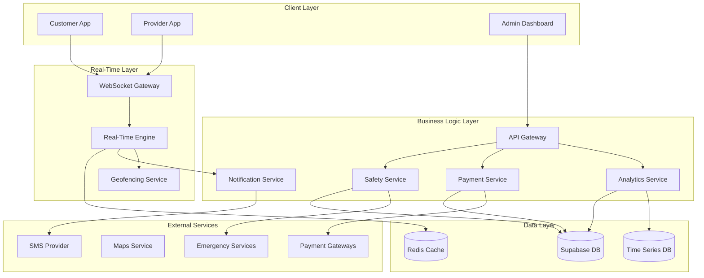

# Design Document: Advanced Platform Features

## Overview

This design document outlines the architecture and implementation approach for advanced features that will complete the Thai Ride App platform. Building on the comprehensive CSS architecture improvements and provider system foundation, this phase focuses on real-time capabilities, intelligent location services, advanced payments, analytics, safety features, and production-grade functionality.

The design emphasizes scalability, real-time performance, and user experience while maintaining the MUNEEF design principles and Thai language support established in previous phases.

## Architecture

### High-Level System Architecture



### Real-Time Communication Architecture

Based on research findings, the system will use WebSocket connections for bidirectional real-time communication, with fallback mechanisms for network reliability:

```typescript
interface RealTimeArchitecture {
  primary: "WebSocket"; // For persistent connections
  fallback: "Server-Sent Events"; // For one-way updates
  queueing: "Redis"; // For offline message queuing
  scaling: "Horizontal"; // Multiple WebSocket servers
}
```

## Components and Interfaces

### 1. Real-Time Engine Component

**Purpose**: Manages all real-time communications between customers, providers, and the system.

**Key Features**:

- WebSocket connection management with automatic reconnection
- Message queuing for offline scenarios
- Location update broadcasting (< 2 seconds latency)
- Chat message delivery (< 1 second latency)
- Connection health monitoring

**Interface**:

```typescript
interface RealTimeEngine {
  establishConnection(
    userId: string,
    userType: "customer" | "provider"
  ): Promise<WebSocket>;
  broadcastLocationUpdate(jobId: string, location: GeoLocation): Promise<void>;
  sendMessage(
    fromUserId: string,
    toUserId: string,
    message: ChatMessage
  ): Promise<void>;
  subscribeToJobUpdates(
    jobId: string,
    callback: (update: JobUpdate) => void
  ): void;
  handleDisconnection(userId: string): Promise<void>;
}
```

### 2. Geofencing System Component

**Purpose**: Provides intelligent location-based features and boundary detection.

**Key Features**:

- High-demand area detection with surge pricing triggers
- Route deviation monitoring (500m threshold)
- Restricted area enforcement
- Speed monitoring and safety alerts
- Special zone protocols (airports, malls)

**Interface**:

```typescript
interface GeofencingSystem {
  createGeofence(boundary: GeoPolygon, rules: GeofenceRules): Promise<string>;
  checkPointInGeofence(
    location: GeoLocation,
    geofenceId: string
  ): Promise<boolean>;
  monitorRouteDeviation(jobId: string, plannedRoute: GeoRoute): Promise<void>;
  detectSpeedViolations(
    providerId: string,
    speed: number,
    location: GeoLocation
  ): Promise<void>;
  getSurgeAreas(): Promise<SurgeArea[]>;
}
```

### 3. Advanced Payment Service Component

**Purpose**: Handles complex payment scenarios including dynamic pricing, instant payouts, and financial reporting.

**Key Features**:

- Dynamic pricing calculation with surge multipliers
- Instant payout processing (< 15 minutes)
- Comprehensive earning reports for tax purposes
- Achievement-based notifications
- Multi-currency support

**Interface**:

```typescript
interface AdvancedPaymentService {
  calculateDynamicFare(
    jobDetails: JobDetails,
    surgeMultiplier: number
  ): Promise<FareBreakdown>;
  processInstantPayout(
    providerId: string,
    amount: number
  ): Promise<PayoutResult>;
  generateTaxReport(providerId: string, year: number): Promise<TaxReport>;
  checkEarningGoals(providerId: string): Promise<GoalStatus[]>;
  handleMultiCurrencyTransaction(transaction: Transaction): Promise<void>;
}
```

### 4. Analytics Engine Component

**Purpose**: Provides real-time analytics and business intelligence capabilities.

**Key Features**:

- Real-time KPI dashboard (sub-second updates)
- Provider performance pattern analysis
- Automated demand-based incentive adjustments
- Service quality monitoring with intervention triggers
- Custom report generation with multiple export formats

**Interface**:

```typescript
interface AnalyticsEngine {
  getRealTimeKPIs(): Promise<KPIDashboard>;
  analyzeProviderPerformance(providerId: string): Promise<PerformanceInsights>;
  adjustIncentives(
    demandPattern: DemandPattern
  ): Promise<IncentiveAdjustment[]>;
  monitorServiceQuality(): Promise<QualityMetrics>;
  generateCustomReport(criteria: ReportCriteria): Promise<ReportData>;
}
```

### 5. Safety and Security Service Component

**Purpose**: Implements comprehensive safety features and security monitoring.

**Key Features**:

- Panic button with emergency response
- Route deviation safety checks
- Behavioral pattern analysis
- Enhanced night-time safety protocols
- Detailed audit logging for authorities

**Interface**:

```typescript
interface SafetyService {
  handlePanicButton(
    userId: string,
    location: GeoLocation
  ): Promise<EmergencyResponse>;
  monitorRouteDeviations(jobId: string): Promise<void>;
  analyzeBehaviorPatterns(providerId: string): Promise<BehaviorAnalysis>;
  enableNightSafetyProtocols(jobId: string): Promise<void>;
  createAuditLog(incident: SafetyIncident): Promise<string>;
}
```

## Data Models

### Enhanced Job Model

```typescript
interface EnhancedJob {
  id: string;
  customerId: string;
  providerId?: string;
  serviceType: ServiceType;
  status: JobStatus;

  // Location data
  pickupLocation: GeoLocation;
  dropoffLocation: GeoLocation;
  currentRoute?: GeoRoute;
  routeDeviations: RouteDeviation[];

  // Pricing
  baseFare: number;
  surgeMultiplier: number;
  dynamicPricing: DynamicPricingFactors;
  finalFare?: number;

  // Real-time data
  providerLocation?: GeoLocation;
  estimatedArrival: Date;
  actualArrival?: Date;

  // Safety
  safetyFlags: SafetyFlag[];
  emergencyContacts: EmergencyContact[];

  // Analytics
  performanceMetrics: JobPerformanceMetrics;

  createdAt: Date;
  updatedAt: Date;
}
```

### Real-Time Message Model

```typescript
interface RealTimeMessage {
  id: string;
  type: "location_update" | "chat_message" | "status_change" | "emergency";
  fromUserId: string;
  toUserId?: string;
  jobId?: string;

  payload: {
    location?: GeoLocation;
    message?: string;
    status?: string;
    emergency?: EmergencyData;
  };

  timestamp: Date;
  delivered: boolean;
  acknowledged: boolean;
}
```

### Geofence Model

```typescript
interface Geofence {
  id: string;
  name: string;
  type: "surge_area" | "restricted_zone" | "special_pickup" | "speed_limit";
  boundary: GeoPolygon;

  rules: {
    surgeMultiplier?: number;
    speedLimit?: number;
    specialInstructions?: string;
    restrictions?: string[];
  };

  isActive: boolean;
  createdAt: Date;
  updatedAt: Date;
}
```

### Advanced Analytics Model

```typescript
interface AnalyticsMetrics {
  id: string;
  timestamp: Date;

  // Real-time KPIs
  activeProviders: number;
  activeJobs: number;
  averageWaitTime: number;
  completionRate: number;

  // Performance metrics
  providerMetrics: {
    providerId: string;
    rating: number;
    acceptanceRate: number;
    cancellationRate: number;
    earningsPerHour: number;
  }[];

  // Business metrics
  revenue: number;
  surgeAreas: SurgeArea[];
  demandHeatmap: DemandPoint[];

  // Quality metrics
  customerSatisfaction: number;
  safetyIncidents: number;
  systemUptime: number;
}
```

Now I need to use the prework tool to analyze the acceptance criteria before writing correctness properties:

## Correctness Properties

_A property is a characteristic or behavior that should hold true across all valid executions of a system-essentially, a formal statement about what the system should do. Properties serve as the bridge between human-readable specifications and machine-verifiable correctness guarantees._

### Real-Time Communication Properties

**Property 1: WebSocket Connection Establishment**
_For any_ job acceptance event, establishing WebSocket connections between customer and provider should complete successfully within the connection timeout period
**Validates: Requirements 1.1**

**Property 2: Location Update Latency**
_For any_ provider location change, the customer's map should receive the update within 2 seconds of the location change occurring
**Validates: Requirements 1.2**

**Property 3: Message Delivery Performance**
_For any_ chat message sent between customer and provider, the message should be delivered within 1 second of being sent
**Validates: Requirements 1.3**

**Property 4: Offline Message Queuing**
_For any_ network disconnection event, all updates during the disconnection should be queued and synchronized when connectivity is restored
**Validates: Requirements 1.4**

**Property 5: Automatic Arrival Notifications**
_For any_ provider arrival at pickup location, the customer should receive an automatic notification with updated ETA information
**Validates: Requirements 1.5**

### Geofencing and Location Intelligence Properties

**Property 6: Surge Area Notifications**
_For any_ provider entering a high-demand geofenced area, surge pricing notifications should be sent immediately upon boundary crossing
**Validates: Requirements 2.1**

**Property 7: Route Deviation Alerts**
_For any_ provider deviating more than 500 meters from the optimal route, both customer and provider should receive alert notifications
**Validates: Requirements 2.2**

**Property 8: Restricted Area Blocking**
_For any_ job request originating in a restricted geofenced area, the request should be blocked and alternative suggestions provided
**Validates: Requirements 2.3**

**Property 9: Speed Violation Logging**
_For any_ provider exceeding safe speed limits, the incident should be logged and safety warnings sent to the provider
**Validates: Requirements 2.4**

**Property 10: Special Zone Protocols**
_For any_ provider entering airport or mall zones, special pickup protocols should be automatically activated
**Validates: Requirements 2.5**

### Advanced Payment Properties

**Property 11: Dynamic Earnings Calculation**
_For any_ completed job, earnings calculation should include all dynamic pricing factors and produce consistent results
**Validates: Requirements 3.1**

**Property 12: Surge Pricing Display**
_For any_ active surge pricing period, the multiplier and estimated earnings should be clearly displayed to providers
**Validates: Requirements 3.2**

**Property 13: Achievement Notifications**
_For any_ provider reaching daily earning goals, achievement notifications should be sent immediately upon goal completion
**Validates: Requirements 3.3**

**Property 14: Tax Report Generation**
_For any_ tax season period, comprehensive earning reports should be generated automatically for all providers
**Validates: Requirements 3.4**

**Property 15: Instant Payout Processing**
_For any_ verified provider requesting instant payout, processing should complete within 15 minutes
**Validates: Requirements 3.5**

### Analytics and Business Intelligence Properties

**Property 16: Real-Time KPI Updates**
_For any_ analytics dashboard view, KPI updates should occur with sub-second latency
**Validates: Requirements 4.1**

**Property 17: Performance Pattern Analysis**
_For any_ provider performance data, the system should identify patterns and generate improvement suggestions
**Validates: Requirements 4.2**

**Property 18: Automated Incentive Adjustments**
_For any_ significant demand pattern change, provider incentives should be automatically adjusted within the adjustment window
**Validates: Requirements 4.3**

**Property 19: Quality Intervention Triggers**
_For any_ decline in service quality metrics below threshold, automated intervention workflows should be triggered
**Validates: Requirements 4.4**

**Property 20: Multi-Format Report Export**
_For any_ report generation request, data should be exportable in multiple formats with custom date range support
**Validates: Requirements 4.5**

### Safety and Security Properties

**Property 21: Emergency Response**
_For any_ panic button activation, emergency contacts and authorities should be alerted immediately
**Validates: Requirements 5.1**

**Property 22: Proactive Safety Monitoring**
_For any_ unusual route deviation detection, proactive safety checks should be initiated automatically
**Validates: Requirements 5.2**

**Property 23: Behavior Pattern Flagging**
_For any_ significant change in provider behavior patterns, the provider should be flagged for review
**Validates: Requirements 5.3**

**Property 24: Night Safety Protocols**
_For any_ night-time ride request, enhanced safety protocols should be automatically enabled
**Validates: Requirements 5.4**

**Property 25: Emergency Audit Logging**
_For any_ emergency situation, detailed audit logs should be created and maintained for authority access
**Validates: Requirements 5.5**

### Notification System Properties

**Property 26: Preference Compliance**
_For any_ notification delivery, user channel preferences and quiet hours should be respected
**Validates: Requirements 6.1**

**Property 27: Multi-Channel Critical Updates**
_For any_ critical system update, multiple notification channels should be used with escalation protocols
**Validates: Requirements 6.2**

**Property 28: Personalized Promotions**
_For any_ promotional offer, personalization should be based on individual usage patterns
**Validates: Requirements 6.3**

**Property 29: Proactive Disruption Communication**
_For any_ service disruption, affected users should be proactively informed with relevant details
**Validates: Requirements 6.4**

**Property 30: Language Localization**
_For any_ notification delivery, the content should be in the user's chosen language preference
**Validates: Requirements 6.5**

### Gamification Properties

**Property 31: Challenge Completion Rewards**
_For any_ daily challenge completion, points should be awarded and achievements unlocked appropriately
**Validates: Requirements 7.1**

**Property 32: Rating-Based Job Priority**
_For any_ high-rated provider, priority job assignments should be provided over lower-rated providers
**Validates: Requirements 7.2**

**Property 33: Milestone Benefits**
_For any_ provider reaching performance milestones, exclusive benefits and recognition should be offered
**Validates: Requirements 7.3**

**Property 34: Performance Coaching**
_For any_ declining provider performance, personalized coaching suggestions should be provided
**Validates: Requirements 7.4**

**Property 35: Leaderboard Updates**
_For any_ leaderboard refresh, provider rankings and progress should be accurately displayed
**Validates: Requirements 7.5**

### Customer Experience Properties

**Property 36: Route Pre-filling**
_For any_ frequently used route booking, details should be pre-filled and optimal times suggested
**Validates: Requirements 8.1**

**Property 37: Weather-Based Adjustments**
_For any_ poor weather conditions, pricing adjustments and appropriate vehicle options should be provided
**Validates: Requirements 8.2**

**Property 38: Accessibility Matching**
_For any_ customer with accessibility needs, matching should prioritize specially equipped providers
**Validates: Requirements 8.3**

**Property 39: Local Area Insights**
_For any_ customer traveling to new areas, relevant local insights and recommendations should be provided
**Validates: Requirements 8.4**

**Property 40: Proactive Issue Resolution**
_For any_ service issue occurrence, proactive compensation and alternatives should be offered
**Validates: Requirements 8.5**

### Integration Properties

**Property 41: Corporate API Real-Time Capabilities**
_For any_ corporate API usage, real-time booking and tracking capabilities should be maintained
**Validates: Requirements 9.1**

**Property 42: Transaction Data Export**
_For any_ expense system integration, detailed transaction data should be exportable in required formats
**Validates: Requirements 9.2**

**Property 43: Centralized Corporate Management**
_For any_ employee transportation management, centralized billing and reporting should be provided
**Validates: Requirements 9.3**

**Property 44: Secure Third-Party Authentication**
_For any_ third-party app connection, secure authentication protocols should be maintained throughout
**Validates: Requirements 9.4**

**Property 45: Bulk Booking Optimization**
_For any_ bulk booking request, provider assignments and routing should be optimized for efficiency
**Validates: Requirements 9.5**

### System Maintenance Properties

**Property 46: Automated Scaling Response**
_For any_ system performance degradation, resources should be automatically scaled and administrators alerted
**Validates: Requirements 10.1**

**Property 47: Error Context Capture**
_For any_ system error occurrence, detailed context should be captured and resolution steps suggested
**Validates: Requirements 10.2**

**Property 48: Maintenance Scheduling**
_For any_ required maintenance, scheduling should occur during low-usage periods with user notifications
**Validates: Requirements 10.3**

**Property 49: Automated Security Protection**
_For any_ detected security threat, automatic protection measures should be implemented immediately
**Validates: Requirements 10.4**

**Property 50: Non-Disruptive Backups**
_For any_ data backup operation, incremental backups should be performed without service interruption
**Validates: Requirements 10.5**

## Error Handling

### Error Categories and Strategies

**Real-Time Communication Errors**:

- WebSocket connection failures: Automatic reconnection with exponential backoff
- Message delivery failures: Queue messages and retry with acknowledgment tracking
- Network timeouts: Graceful degradation to polling mode

**Geofencing Errors**:

- GPS accuracy issues: Use multiple location sources and confidence intervals
- Boundary calculation errors: Implement buffer zones and validation checks
- Performance degradation: Cache geofence data and use spatial indexing

**Payment Processing Errors**:

- Gateway failures: Implement multiple payment provider fallbacks
- Currency conversion errors: Use real-time exchange rates with error margins
- Payout delays: Provide clear status updates and estimated completion times

**Analytics Errors**:

- Data processing failures: Implement data validation and error recovery
- Report generation timeouts: Use asynchronous processing with progress indicators
- Performance metric calculation errors: Validate inputs and use fallback calculations

**Safety System Errors**:

- Emergency service failures: Maintain multiple contact methods and escalation paths
- False positive alerts: Implement confidence scoring and manual override options
- Audit log failures: Use redundant logging systems and integrity checks

### Error Recovery Mechanisms

```typescript
interface ErrorRecoveryStrategy {
  retryPolicy: {
    maxAttempts: number;
    backoffStrategy: "exponential" | "linear" | "fixed";
    baseDelay: number;
  };
  fallbackMechanism: string;
  userNotification: boolean;
  escalationPath: string[];
}
```

## Testing Strategy

### Dual Testing Approach

The system will employ both unit testing and property-based testing to ensure comprehensive coverage:

**Unit Tests**:

- Specific examples of real-time message delivery
- Edge cases for geofencing boundary calculations
- Error conditions for payment processing
- Integration points between components
- Safety protocol activation scenarios

**Property-Based Tests**:

- Universal properties across all real-time communications (Properties 1-5)
- Geofencing behavior for any location and boundary combination (Properties 6-10)
- Payment calculations for any job and pricing scenario (Properties 11-15)
- Analytics accuracy for any data input (Properties 16-20)
- Safety responses for any emergency scenario (Properties 21-25)
- Notification delivery for any user preference (Properties 26-30)
- Gamification mechanics for any provider activity (Properties 31-35)
- Customer experience features for any usage pattern (Properties 36-40)
- Integration capabilities for any third-party system (Properties 41-45)
- System maintenance for any operational scenario (Properties 46-50)

### Property-Based Testing Configuration

- **Testing Framework**: fast-check for TypeScript/JavaScript
- **Minimum Iterations**: 100 per property test
- **Test Tagging**: Each property test must reference its design document property
- **Tag Format**: `Feature: advanced-platform-features, Property {number}: {property_text}`

### Performance Testing Requirements

- **Real-time latency**: < 2 seconds for location updates, < 1 second for messages
- **Analytics updates**: Sub-second KPI refresh rates
- **Payment processing**: < 15 minutes for instant payouts
- **Emergency response**: Immediate alert delivery (< 5 seconds)
- **System scaling**: Automatic resource scaling within 30 seconds of degradation

### Load Testing Scenarios

- **Concurrent users**: 10,000+ simultaneous WebSocket connections
- **Message throughput**: 1,000+ messages per second
- **Geofencing queries**: 5,000+ location checks per second
- **Payment processing**: 100+ concurrent transactions
- **Analytics queries**: Real-time dashboard with 100+ concurrent viewers

### Security Testing

- **Authentication**: Test all API endpoints and WebSocket connections
- **Authorization**: Verify role-based access controls
- **Data encryption**: Ensure all sensitive data is encrypted in transit and at rest
- **Input validation**: Test all user inputs for injection attacks
- **Rate limiting**: Verify API rate limits and abuse prevention

The comprehensive testing strategy ensures that all advanced platform features meet performance, reliability, and security requirements while maintaining the high-quality user experience expected from a production ride-hailing platform.
