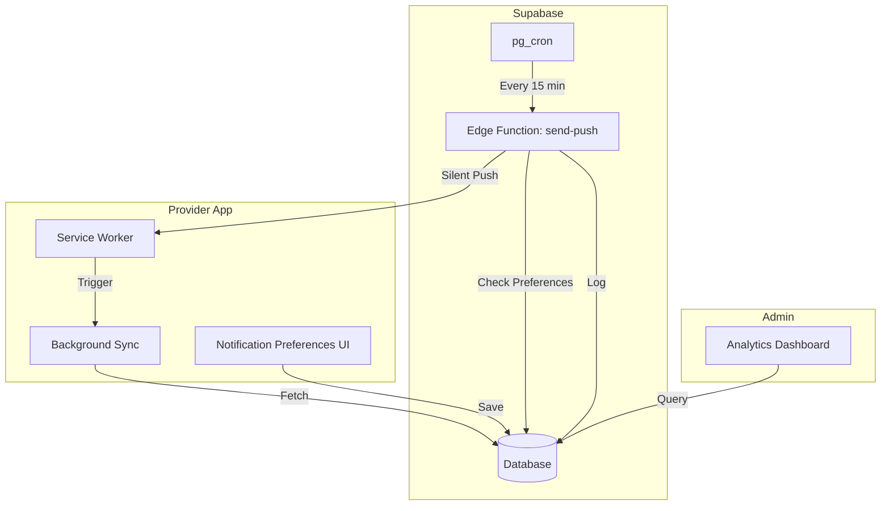

# Design Document: Enhanced Push Notification System

## Overview

ระบบ Push Notification ขั้นสูงที่เพิ่ม 3 ความสามารถหลัก:

1. **Silent Push** - ส่ง push แบบไม่แสดงผลเพื่อ trigger background sync
2. **Notification Preferences** - ให้ Provider เลือกประเภท notification ที่ต้องการรับ
3. **Push Analytics** - Dashboard สำหรับ Admin ดูสถิติการส่ง notification

## Architecture



## Components and Interfaces

### 1. Notification Categories

```typescript
type NotificationCategory =
  | "new_job" // งานใหม่
  | "job_update" // อัพเดทสถานะงาน
  | "earnings" // รายได้/การเงิน
  | "promotions" // โปรโมชั่น
  | "system_announcements"; // ประกาศระบบ

interface NotificationPreference {
  provider_id: string;
  category: NotificationCategory;
  enabled: boolean;
  updated_at: string;
}
```

### 2. useNotificationPreferences Composable

```typescript
interface NotificationPreferencesState {
  preferences: Ref<NotificationPreference[]>;
  loading: Ref<boolean>;
  error: Ref<string | null>;
}

interface NotificationPreferencesActions {
  loadPreferences(): Promise<void>;
  toggleCategory(
    category: NotificationCategory,
    enabled: boolean
  ): Promise<void>;
  isEnabled(category: NotificationCategory): boolean;
  testNotification(): Promise<void>;
}

function useNotificationPreferences(): NotificationPreferencesState &
  NotificationPreferencesActions;
```

### 3. Silent Push Handler (Service Worker)

```typescript
// sw-push.js additions
interface SilentPushPayload {
  type: "silent_sync";
  data: {
    sync_type: "jobs" | "earnings" | "all";
    timestamp: string;
  };
}

// Handle silent push
self.addEventListener("push", (event) => {
  const data = event.data?.json();

  if (data.type === "silent_sync") {
    // Don't show notification, just trigger sync
    event.waitUntil(self.registration.sync.register("background-sync"));
    return;
  }

  // Normal notification handling...
});
```

### 4. Push Analytics Composable

```typescript
interface PushAnalytics {
  totalSent: number;
  totalDelivered: number;
  totalFailed: number;
  deliveryRate: number;
  failureRate: number;
  avgLatencyMs: number;
}

interface PushLogEntry {
  id: string;
  provider_id: string;
  notification_type: NotificationCategory;
  title: string;
  body: string;
  status: "sent" | "delivered" | "failed";
  error_message: string | null;
  sent_at: string;
  delivered_at: string | null;
  latency_ms: number | null;
}

interface VolumeDataPoint {
  date: string;
  count: number;
  type: NotificationCategory;
}

interface FailureReason {
  error_message: string;
  count: number;
}

function usePushAnalytics(): {
  analytics: Ref<PushAnalytics | null>;
  volumeData: Ref<VolumeDataPoint[]>;
  failureReasons: Ref<FailureReason[]>;
  logs: Ref<PushLogEntry[]>;
  loading: Ref<boolean>;
  loadAnalytics(days: number): Promise<void>;
  loadLogs(startDate: string, endDate: string): Promise<void>;
};
```

## Data Models

### notification_preferences Table

```sql
CREATE TABLE notification_preferences (
  id UUID PRIMARY KEY DEFAULT gen_random_uuid(),
  provider_id UUID NOT NULL REFERENCES providers_v2(id) ON DELETE CASCADE,
  category TEXT NOT NULL CHECK (category IN ('new_job', 'job_update', 'earnings', 'promotions', 'system_announcements')),
  enabled BOOLEAN DEFAULT true,
  created_at TIMESTAMPTZ DEFAULT NOW(),
  updated_at TIMESTAMPTZ DEFAULT NOW(),
  UNIQUE(provider_id, category)
);
```

### push_logs Table

```sql
CREATE TABLE push_logs (
  id UUID PRIMARY KEY DEFAULT gen_random_uuid(),
  provider_id UUID REFERENCES providers_v2(id) ON DELETE SET NULL,
  notification_type TEXT NOT NULL,
  title TEXT NOT NULL,
  body TEXT,
  status TEXT NOT NULL CHECK (status IN ('sent', 'delivered', 'failed')),
  error_message TEXT,
  sent_at TIMESTAMPTZ DEFAULT NOW(),
  delivered_at TIMESTAMPTZ,
  latency_ms INTEGER,
  metadata JSONB DEFAULT '{}'
);

-- Indexes for analytics
CREATE INDEX idx_push_logs_sent_at ON push_logs(sent_at DESC);
CREATE INDEX idx_push_logs_type_sent ON push_logs(notification_type, sent_at DESC);
CREATE INDEX idx_push_logs_status ON push_logs(status);
CREATE INDEX idx_push_logs_provider ON push_logs(provider_id);
```

## Correctness Properties

_A property is a characteristic or behavior that should hold true across all valid executions of a system—essentially, a formal statement about what the system should do._

### Property 1: Silent Push Does Not Display Notification

_For any_ silent push payload with type='silent_sync', the service worker SHALL NOT call showNotification.

**Validates: Requirements 1.1**

### Property 2: Background Sync Updates Cached Data

_For any_ background sync trigger, the cached jobs and earnings data SHALL be updated with fresh data from the server.

**Validates: Requirements 1.2, 1.3**

### Property 3: Disabled Categories Filter Notifications

_For any_ notification of a specific category, if the Provider has disabled that category, the notification SHALL NOT be sent to that Provider.

**Validates: Requirements 2.3**

### Property 4: New Providers Have All Categories Enabled

_For any_ newly created Provider, all notification categories SHALL be enabled by default.

**Validates: Requirements 2.4**

### Property 5: Preference Changes Persist Immediately

_For any_ preference change, reading the preference immediately after saving SHALL return the new value.

**Validates: Requirements 2.5**

### Property 6: Permission Status Displayed Correctly

_For any_ notification permission state (granted/denied/default), the UI SHALL display the correct status.

**Validates: Requirements 3.3**

### Property 7: Push Logs Contain All Required Fields

_For any_ push notification sent, the log entry SHALL contain: timestamp, provider_id, notification_type, status. If failed, it SHALL also contain error_message.

**Validates: Requirements 4.1, 4.3**

### Property 8: Latency Calculation Correctness

_For any_ delivered notification, latency_ms SHALL equal (delivered_at - sent_at) in milliseconds.

**Validates: Requirements 4.4**

### Property 9: Analytics Metrics Calculation

_For any_ set of push logs, the analytics metrics SHALL be calculated as:

- delivery_rate = delivered_count / total_sent \* 100
- failure_rate = failed_count / total_sent \* 100

**Validates: Requirements 5.1**

### Property 10: Volume Aggregation by Time

_For any_ time period, the volume chart data SHALL correctly aggregate notification counts by date.

**Validates: Requirements 5.2**

### Property 11: Breakdown by Notification Type

_For any_ set of push logs, the breakdown SHALL correctly group and count by notification_type.

**Validates: Requirements 5.3**

### Property 12: Failure Reasons Aggregation

_For any_ set of failed push logs, the failure reasons SHALL be grouped by error_message and sorted by count descending.

**Validates: Requirements 5.4**

### Property 13: Preferences Unique Constraint

_For any_ attempt to insert a duplicate (provider_id, category) pair, the database SHALL reject or upsert.

**Validates: Requirements 6.2**

### Property 14: Preferences RLS Isolation

_For any_ Provider querying notification_preferences, the result SHALL contain only their own preferences.

**Validates: Requirements 6.3**

### Property 15: Push Logs Admin-Only RLS

_For any_ non-Admin user querying push_logs, the result SHALL be empty.

**Validates: Requirements 7.3**

## Error Handling

### Silent Push Errors

| Error                    | Handling                      |
| ------------------------ | ----------------------------- |
| Sync registration failed | Log error, retry on next push |
| Network offline          | Queue sync for when online    |
| Cache storage full       | Clear old cache, retry        |

### Preference Errors

| Error       | Handling                             |
| ----------- | ------------------------------------ |
| Save failed | Show error toast, retry button       |
| Load failed | Show cached preferences if available |

### Analytics Errors

| Error         | Handling                       |
| ------------- | ------------------------------ |
| Query timeout | Show partial data with warning |
| No data       | Show empty state message       |

## Testing Strategy

### Unit Tests

- Test preference toggle logic
- Test analytics calculation functions
- Test silent push detection in service worker
- Test latency calculation

### Property-Based Tests

Using `fast-check` library:

1. **Preference filtering** - Generate random preferences and notifications, verify filtering
2. **Analytics calculation** - Generate random logs, verify metrics
3. **RLS isolation** - Generate random provider IDs, verify query isolation

### Integration Tests

- Test full preference save/load flow
- Test silent push → background sync flow
- Test analytics dashboard with real data

### Configuration

- Property tests: minimum 100 iterations
- Test tag format: **Feature: enhanced-push-notification-system, Property {number}: {property_text}**
