# Design Document: Map Enhancements

## Overview

ระบบ Map Enhancements ประกอบด้วย 3 ส่วนหลัก:

1. **Notes System** - เพิ่มความสามารถในการบันทึกข้อความจากลูกค้าใน ride requests
2. **Map Tile Preloader** - โหลด map tiles ล่วงหน้าเพื่อให้แผนที่แสดงผลเร็วขึ้น
3. **Offline Tile Cache** - แคช map tiles สำหรับใช้งานแบบออฟไลน์ผ่าน IndexedDB และ Service Worker

### Technology Stack

- **Database**: Supabase PostgreSQL (notes column)
- **Storage**: IndexedDB (tile cache)
- **Caching**: Service Worker + Workbox
- **Map Library**: Leaflet with custom tile layer
- **State Management**: Pinia store for cache status

## Architecture


### Data Flow

```mermaid
sequenceDiagram
    participant User
    participant MapView
    participant TileService
    participant Cache as IndexedDB
    participant CDN as Tile CDN

    User->>MapView: Open map
    MapView->>TileService: Request tiles
    TileService->>Cache: Check cache

    alt Tiles cached
        Cache-->>TileService: Return cached tiles
        TileService-->>MapView: Display immediately
    else Not cached
        TileService->>CDN: Fetch tiles
        CDN-->>TileService: Return tiles
        TileService->>Cache: Store tiles
        TileService-->>MapView: Display tiles
    end

    Note over TileService: Background preloading
    TileService->>CDN: Preload adjacent tiles
    CDN-->>TileService: Return tiles
    TileService->>Cache: Store for offline
```



## Components and Interfaces

### 1. Notes System

#### Database Schema Change

```sql
-- Add notes column to ride_requests
ALTER TABLE ride_requests
ADD COLUMN notes TEXT CHECK (LENGTH(notes) <= 500);
```

#### NotesInput Component

```typescript
// src/components/ride/NotesInput.vue
interface NotesInputProps {
  modelValue: string;
  maxLength?: number; // default: 500
  placeholder?: string;
}

interface NotesInputEmits {
  "update:modelValue": [value: string];
}
```

### 2. Map Tile Service

#### TilePreloader

```typescript
// src/services/mapTilePreloader.ts
interface TilePreloaderConfig {
  maxTilesPerSession: number; // default: 50
  zoomLevels: number[]; // default: [12, 13, 14, 15, 16]
  tileSize: number; // default: 256
}

interface TileCoordinate {
  x: number;
  y: number;
  z: number;
}

interface PreloadProgress {
  total: number;
  loaded: number;
  failed: number;
  percentage: number;
}

class TilePreloader {
  constructor(config: TilePreloaderConfig);

  // Preload tiles around a location
  preloadArea(
    lat: number,
    lng: number,
    radiusKm?: number
  ): Promise<PreloadProgress>;

  // Cancel ongoing preload
  cancel(): void;

  // Get preload status
  getProgress(): PreloadProgress;
}
```

#### TileCacheManager

```typescript
// src/services/tileCacheManager.ts
interface CacheConfig {
  maxSizeMB: number; // default: 100
  ttlDays: number; // default: 7
  dbName: string; // default: 'map-tiles-cache'
}

interface CacheStats {
  sizeBytes: number;
  sizeMB: number;
  tileCount: number;
  oldestTile: Date | null;
  newestTile: Date | null;
}

interface CachedTile {
  key: string; // "z/x/y"
  blob: Blob;
  timestamp: number;
  size: number;
}

class TileCacheManager {
  constructor(config: CacheConfig);

  // Store a tile
  put(coord: TileCoordinate, blob: Blob): Promise<void>;

  // Get a tile
  get(coord: TileCoordinate): Promise<Blob | null>;

  // Check if tile exists and is valid
  has(coord: TileCoordinate): Promise<boolean>;

  // Get cache statistics
  getStats(): Promise<CacheStats>;

  // Clear all cached tiles
  clear(): Promise<void>;

  // Remove expired tiles
  pruneExpired(): Promise<number>;

  // Enforce size limit using LRU
  enforceSizeLimit(): Promise<number>;
}
```

### 3. Custom Leaflet Tile Layer

```typescript
// src/lib/CachedTileLayer.ts
import L from "leaflet";

interface CachedTileLayerOptions extends L.TileLayerOptions {
  cacheManager: TileCacheManager;
  offlineMode?: boolean;
}

class CachedTileLayer extends L.TileLayer {
  constructor(urlTemplate: string, options: CachedTileLayerOptions);

  // Override createTile to check cache first
  createTile(coords: L.Coords, done: L.DoneCallback): HTMLElement;

  // Enable/disable offline mode
  setOfflineMode(enabled: boolean): void;
}
```

### 4. Offline Map Download

```typescript
// src/composables/useOfflineMapDownload.ts
interface DownloadArea {
  center: { lat: number; lng: number };
  radiusKm: number;
  zoomLevels: number[];
}

interface DownloadProgress {
  status: "idle" | "downloading" | "completed" | "failed";
  total: number;
  downloaded: number;
  failed: number;
  percentage: number;
  estimatedSizeMB: number;
}

function useOfflineMapDownload() {
  const progress: Ref<DownloadProgress>;
  const isDownloading: ComputedRef<boolean>;

  // Estimate download size
  function estimateSize(area: DownloadArea): number;

  // Start download
  function download(area: DownloadArea): Promise<void>;

  // Cancel download
  function cancel(): void;

  return { progress, isDownloading, estimateSize, download, cancel };
}
```

### 5. Cache Settings UI

```typescript
// src/components/settings/MapCacheSettings.vue
interface MapCacheSettingsProps {
  // No props needed
}

interface MapCacheSettingsEmits {
  "cache-cleared": [];
  "download-started": [area: DownloadArea];
}
```

## Data Models

### Database Schema

```sql
-- Migration: 248_ride_request_notes.sql

BEGIN;

-- Add notes column to ride_requests
ALTER TABLE ride_requests
ADD COLUMN IF NOT EXISTS notes TEXT;

-- Add constraint for max length
ALTER TABLE ride_requests
ADD CONSTRAINT ride_requests_notes_length
CHECK (notes IS NULL OR LENGTH(notes) <= 500);

-- Index for searching notes (optional, for admin)
CREATE INDEX IF NOT EXISTS idx_ride_requests_notes
ON ride_requests USING gin(to_tsvector('simple', COALESCE(notes, '')));

COMMIT;
```

### IndexedDB Schema

```typescript
// Tile Cache Database Schema
interface TileCacheDB {
  tiles: {
    key: string; // "z/x/y" format
    value: {
      blob: Blob;
      timestamp: number; // Unix timestamp
      size: number; // bytes
      lastAccessed: number; // For LRU
    };
  };
  metadata: {
    key: "stats";
    value: {
      totalSize: number;
      tileCount: number;
      lastPruned: number;
    };
  };
}
```

### TypeScript Types

```typescript
// src/types/map.ts

export interface TileCoordinate {
  x: number;
  y: number;
  z: number;
}

export interface CacheStats {
  sizeBytes: number;
  sizeMB: number;
  tileCount: number;
  oldestTile: Date | null;
  newestTile: Date | null;
}

export interface PreloadConfig {
  maxTiles: number;
  zoomLevels: number[];
  radiusKm: number;
}

export interface OfflineArea {
  id: string;
  name: string;
  center: { lat: number; lng: number };
  radiusKm: number;
  downloadedAt: Date;
  tileCount: number;
  sizeMB: number;
}
```
