# 🏗️ Provider Profile System - Architecture Diagrams

## System Overview

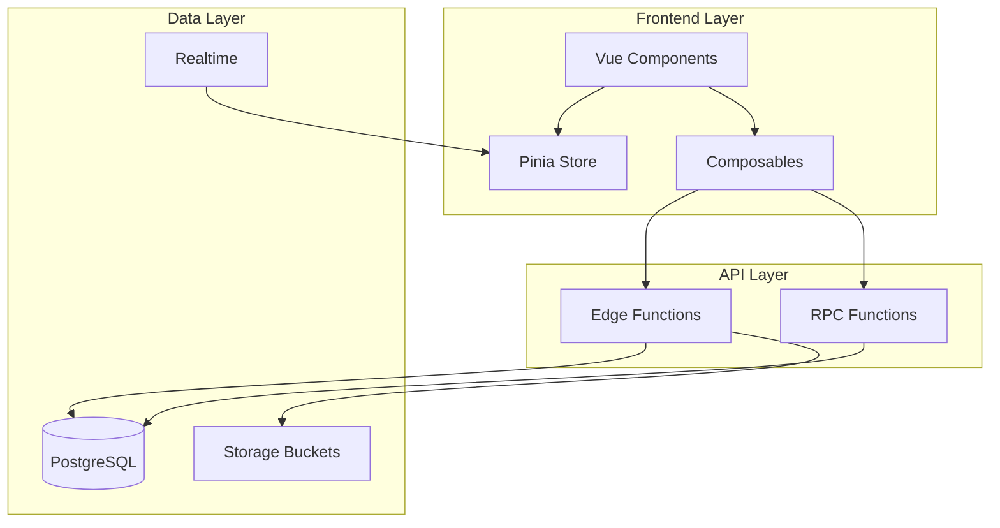

## Component Hierarchy

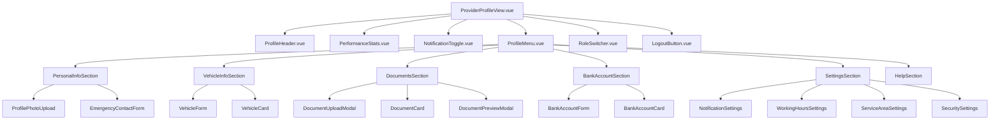

## Data Flow: Profile Update

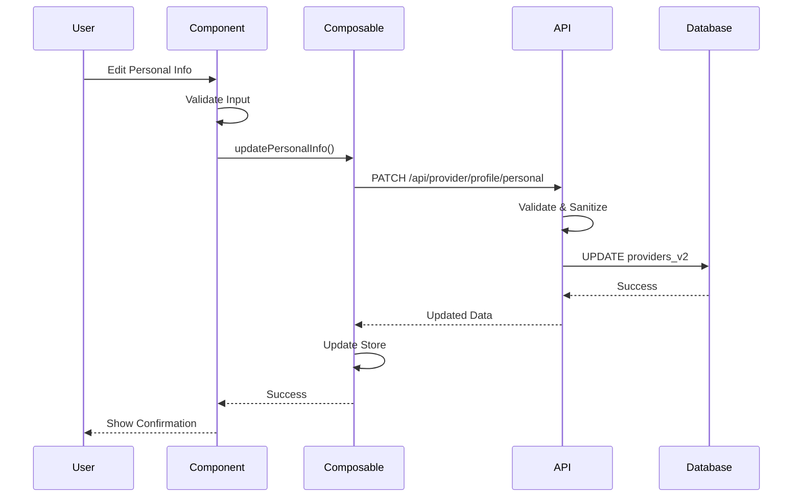

## Data Flow: Document Upload

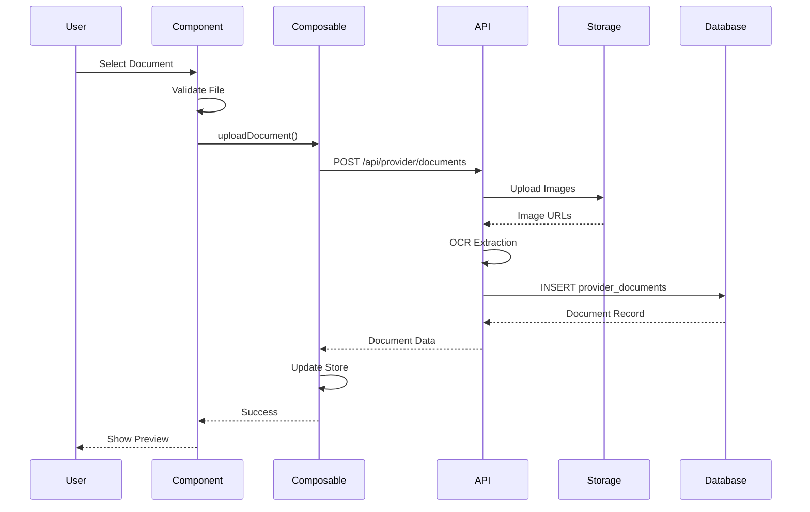

## Database Schema Relationships

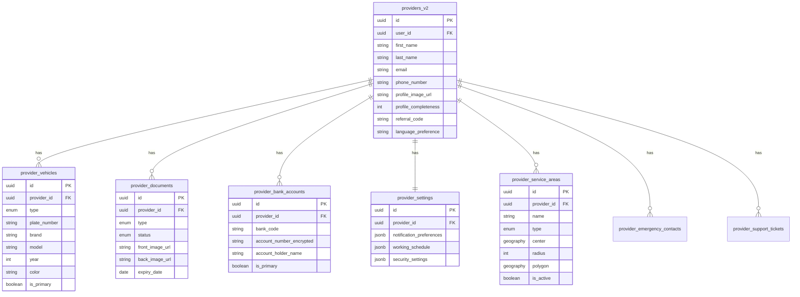

## State Management Flow

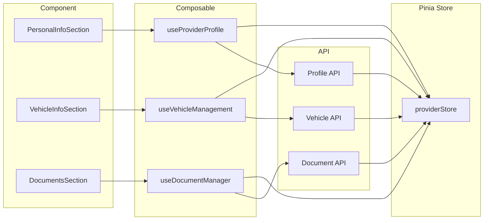

## Security Architecture

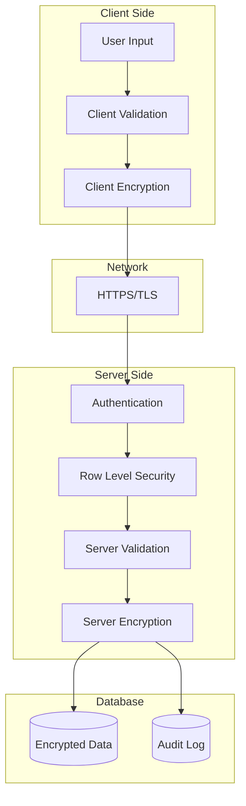

## Profile Completeness Calculation

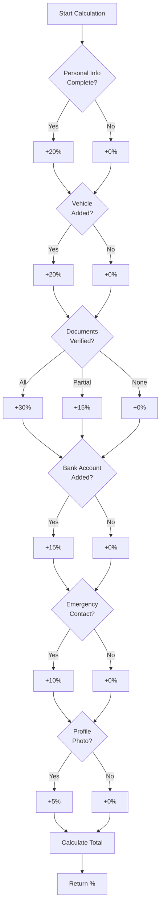

## Document Verification Flow

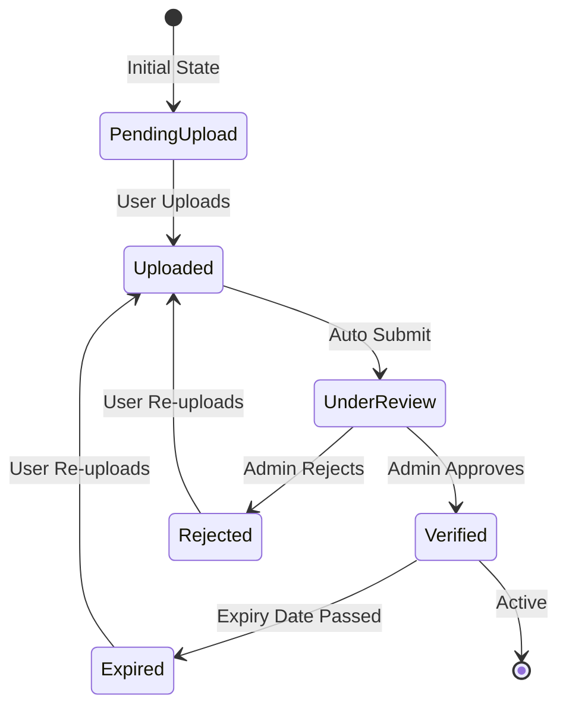

## Working Hours Configuration

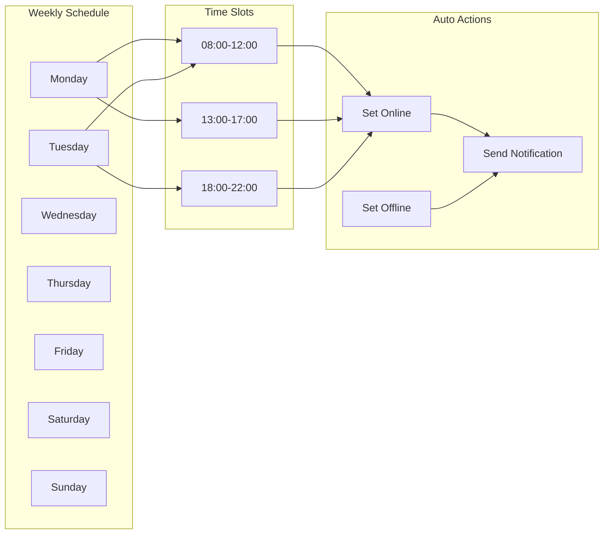

## Service Area Selection

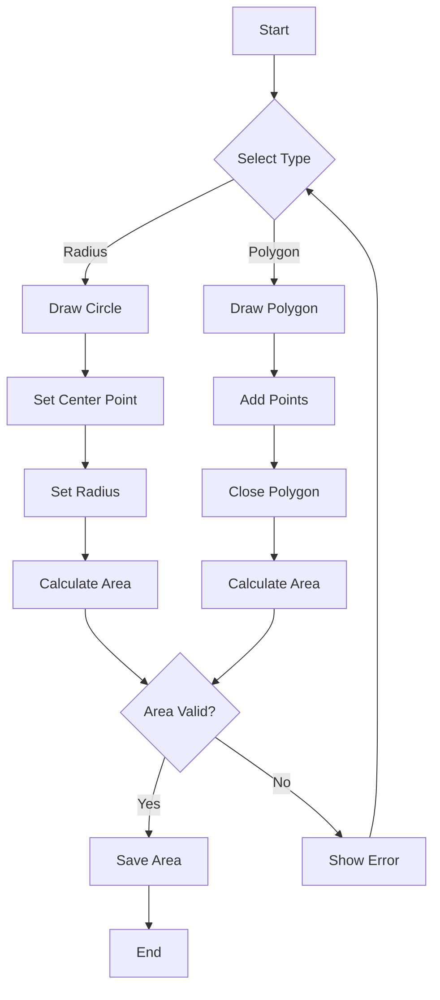

## API Request Flow with Rate Limiting

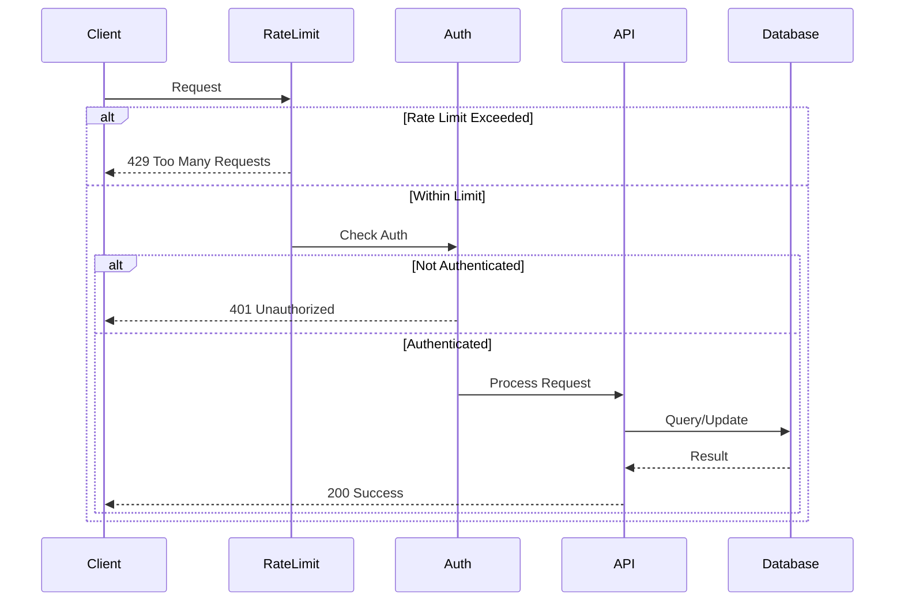

## Offline Support Architecture

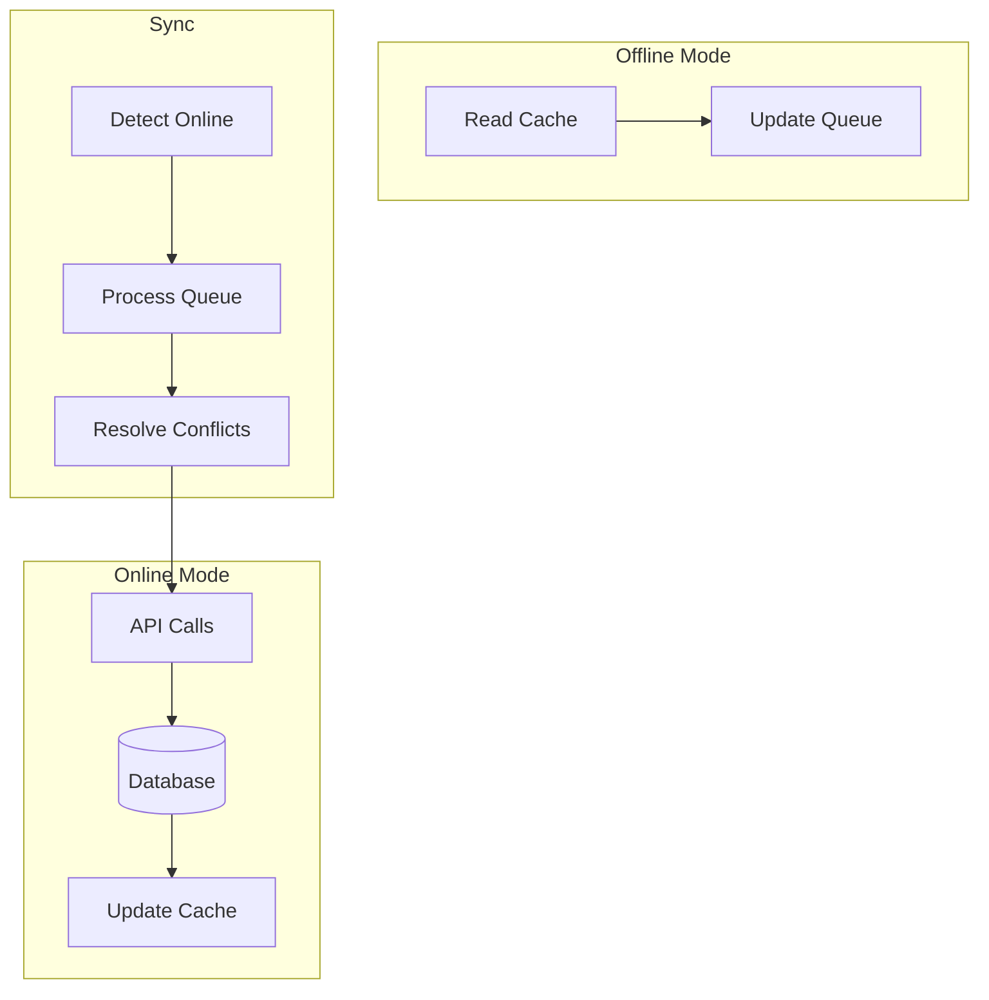

## Performance Optimization Strategy

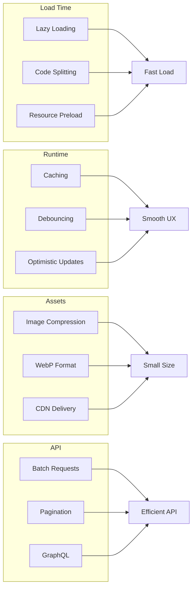

---

**Note:** These diagrams provide a visual overview of the system architecture. Refer to the detailed design document for implementation specifics.
