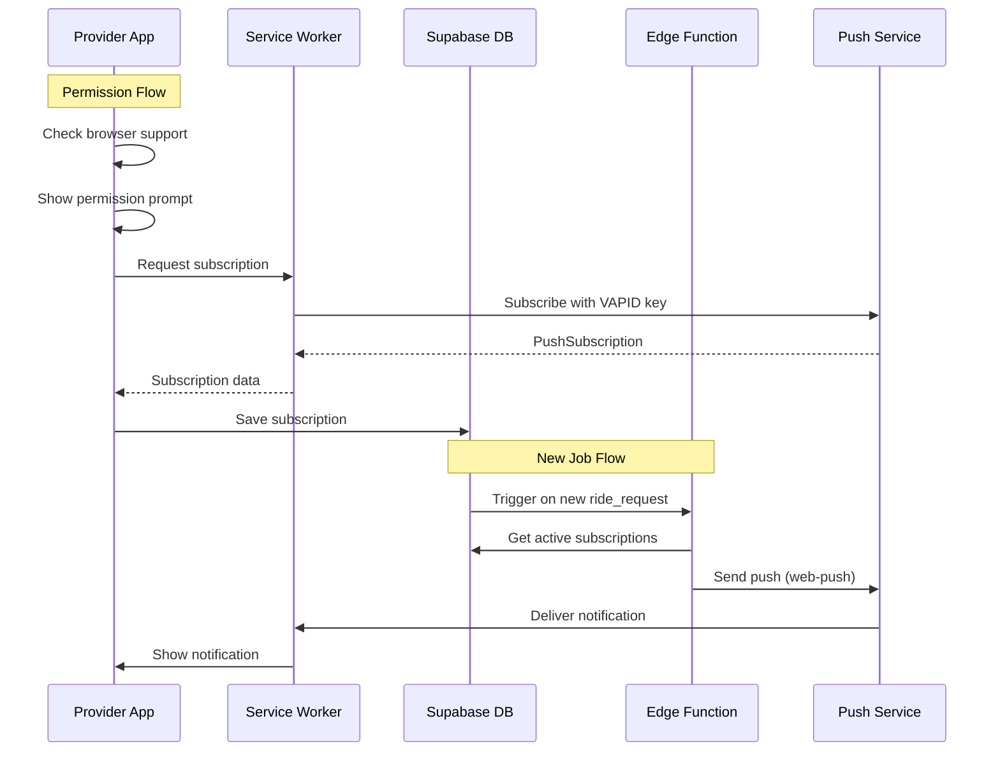

# Design Document: Provider Push Notifications

## Overview

ระบบ Push Notification สำหรับ Provider ใช้ Web Push API เพื่อส่งการแจ้งเตือนงานใหม่ไปยังอุปกรณ์ของ Provider แม้ว่าแอปจะปิดอยู่ ระบบประกอบด้วย:

1. **Frontend Composable** (`usePushNotification`) - จัดการ permission, subscription, และแสดง notification
2. **Service Worker** (`sw-push.js`) - รับและแสดง push notification ใน background
3. **Database Table** (`push_subscriptions`) - เก็บข้อมูล subscription ของแต่ละ Provider
4. **Edge Function** (`send-push-notification`) - ส่ง push notification จาก server

## Architecture



## Components and Interfaces

### 1. usePushNotification Composable

```typescript
interface PushNotificationState {
  isSupported: Ref<boolean>;
  isSubscribed: Ref<boolean>;
  permission: Ref<NotificationPermission>;
  loading: Ref<boolean>;
  error: Ref<string | null>;
}

interface PushNotificationActions {
  requestPermission(): Promise<boolean>;
  subscribe(): Promise<PushSubscription | null>;
  unsubscribe(): Promise<boolean>;
  showLocalNotification(title: string, options?: NotificationOptions): void;
  notifyNewJob(job: Job): void;
}

function usePushNotification(): PushNotificationState & PushNotificationActions;
```

### 2. Service Worker Push Handler

```typescript
// sw-push.js event handlers
interface PushPayload {
  title: string;
  body: string;
  icon?: string;
  badge?: string;
  tag?: string;
  data?: {
    jobId?: string;
    url?: string;
    type?: "new_job" | "job_update" | "system";
  };
  vibrate?: number[];
  requireInteraction?: boolean;
  actions?: NotificationAction[];
}

// Events handled:
// - push: Receive and display notification
// - notificationclick: Handle user interaction
// - notificationclose: Track dismissals
// - pushsubscriptionchange: Handle subscription updates
```

### 3. Edge Function Interface

```typescript
// POST /functions/v1/send-push-notification
interface SendPushRequest {
  provider_ids?: string[]; // Specific providers, or all online if omitted
  title: string;
  body: string;
  data?: Record<string, unknown>;
}

interface SendPushResponse {
  success: boolean;
  sent: number;
  failed: number;
  errors?: Array<{
    provider_id: string;
    error: string;
  }>;
}
```

## Data Models

### push_subscriptions Table

```sql
CREATE TABLE push_subscriptions (
  id UUID PRIMARY KEY DEFAULT gen_random_uuid(),
  provider_id UUID NOT NULL REFERENCES providers_v2(id) ON DELETE CASCADE,
  endpoint TEXT NOT NULL,
  keys JSONB NOT NULL,  -- { p256dh: string, auth: string }
  user_agent TEXT,
  created_at TIMESTAMPTZ DEFAULT NOW(),
  updated_at TIMESTAMPTZ DEFAULT NOW(),
  last_used_at TIMESTAMPTZ,
  is_active BOOLEAN DEFAULT true,
  UNIQUE(provider_id, endpoint)
);
```

### Subscription Keys Structure

```typescript
interface SubscriptionKeys {
  p256dh: string; // Base64 encoded public key
  auth: string; // Base64 encoded auth secret
}
```

## Correctness Properties

_A property is a characteristic or behavior that should hold true across all valid executions of a system—essentially, a formal statement about what the system should do. Properties serve as the bridge between human-readable specifications and machine-verifiable correctness guarantees._

### Property 1: Prompt Visibility Logic

_For any_ combination of browser support state, subscription state, and dismissal timestamp, the notification prompt visibility SHALL follow these rules:

- If browser does not support push → prompt is hidden
- If already subscribed → prompt is hidden
- If dismissed within 7 days → prompt is hidden
- Otherwise → prompt is shown after 3 seconds

**Validates: Requirements 1.1, 1.2, 1.5**

### Property 2: Subscription Storage Round-Trip

_For any_ valid push subscription created by the browser, storing it in the database and retrieving it SHALL return equivalent endpoint and keys data.

**Validates: Requirements 2.2**

### Property 3: Subscription Upsert Idempotence

_For any_ Provider with an existing subscription, upserting the same subscription (same endpoint) SHALL NOT increase the total subscription count for that Provider.

**Validates: Requirements 2.3**

### Property 4: Notification Recipient Filtering

_For any_ new ride_request with status 'pending', the set of notification recipients SHALL include only Providers where:

- is_online = true
- has active subscription (is_active = true)

**Validates: Requirements 3.1, 3.5**

### Property 5: Notification Content Completeness

_For any_ job notification, the notification body SHALL contain:

- Service type icon (emoji)
- Estimated fare (formatted as ฿X)
- Pickup address

**Validates: Requirements 3.2**

### Property 6: Notification Options Correctness

_For any_ job notification, the notification options SHALL include:

- vibrate pattern [200, 100, 200]
- requireInteraction = true

**Validates: Requirements 3.3**

### Property 7: Badge Visibility Matches Subscription State

_For any_ subscription state (subscribed or not), the notification badge visibility SHALL equal the subscription state.

**Validates: Requirements 5.1, 5.2**

### Property 8: Subscription Deactivation on Push Failure

_For any_ push delivery that returns HTTP 410 (Gone) or 404 (Not Found), the corresponding subscription SHALL be marked as is_active = false.

**Validates: Requirements 6.3**

### Property 9: Unique Constraint Enforcement

_For any_ attempt to insert a duplicate (provider_id, endpoint) pair, the database SHALL either reject the insert or perform an upsert.

**Validates: Requirements 7.2**

### Property 10: Provider RLS Isolation

_For any_ Provider querying push_subscriptions, the result set SHALL contain only subscriptions where provider_id matches their own provider record.

**Validates: Requirements 7.3**

### Property 11: Admin RLS Access

_For any_ Admin querying push_subscriptions, the result set SHALL contain all subscriptions regardless of provider_id.

**Validates: Requirements 7.4**

### Property 12: Updated_at Trigger

_For any_ update to a push_subscription record, the updated_at timestamp SHALL be greater than or equal to the previous value.

**Validates: Requirements 7.5**

### Property 13: Payload Parsing Correctness

_For any_ valid push payload JSON, parsing it SHALL produce a notification with matching title, body, and icon fields.

**Validates: Requirements 4.2**

## Error Handling

### Frontend Errors

| Error                 | Handling                          |
| --------------------- | --------------------------------- |
| Browser not supported | Hide prompt, log warning          |
| Permission denied     | Show error message, disable retry |
| Subscription failed   | Show error toast, allow retry     |
| VAPID key missing     | Log warning, disable push         |

### Edge Function Errors

| Error                 | Handling                                 |
| --------------------- | ---------------------------------------- |
| 410 Gone              | Mark subscription inactive               |
| 404 Not Found         | Mark subscription inactive               |
| 429 Too Many Requests | Retry with exponential backoff           |
| Network error         | Log error, continue to next subscription |

### Service Worker Errors

| Error             | Handling                  |
| ----------------- | ------------------------- |
| Invalid payload   | Show generic notification |
| Navigation failed | Open new window           |

## Testing Strategy

### Unit Tests

- Test `shouldShowNotificationPrompt()` logic with various states
- Test `notifyNewJob()` notification content formatting
- Test VAPID key conversion functions
- Test subscription data serialization

### Property-Based Tests

Using `fast-check` library for property-based testing:

1. **Prompt visibility property** - Generate random combinations of support/subscription/dismissal states
2. **Subscription upsert idempotence** - Generate random subscriptions and verify count stability
3. **Notification content property** - Generate random jobs and verify content includes required fields
4. **RLS isolation property** - Generate random provider IDs and verify query isolation

### Integration Tests

- Test full subscription flow: permission → subscribe → save to DB
- Test notification delivery: create job → trigger → receive notification
- Test unsubscribe flow: unsubscribe → mark inactive

### Configuration

- Property tests: minimum 100 iterations
- Test tag format: **Feature: provider-push-notifications, Property {number}: {property_text}**
